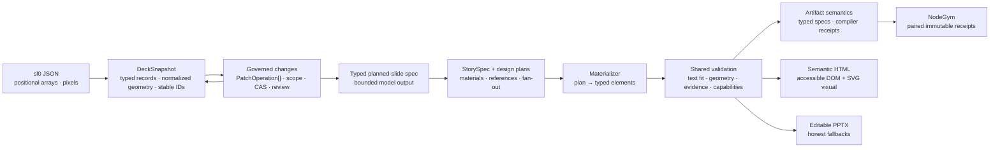
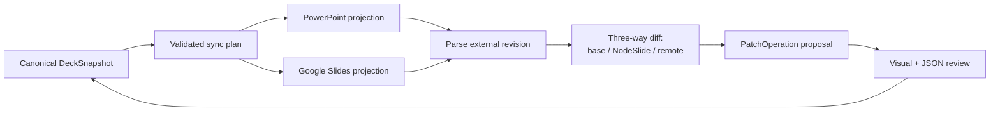

# NodeSlide

**Reviewable deck-as-code. Every AI edit is a scoped, validated, receipted proposal — never a silent overwrite.**

[**Live demo →**](https://nodeslide.vercel.app) · React 19 + Convex + Vite · [`agentic-ui-qa`](https://github.com/HomenShum/agentic-ui-qa)-audited · Built for the AI Fund SlideLang EIR Build Challenge

> NodeSlide turns a prompt, a structured brief, or raw data into a presentation you can *inspect and defend* — a canonical structured document that compiles to editable slides, where every change (human or agent) flows through one validated mutation path.

> **Repository status (2026-07-22):** NodeSlide is a standalone product repo with
> exact-commit CI, Convex/Vercel deployment gates, production probes, and packed
> consumer proofs. The test corpus changes with the product, so this README does
> not freeze a test/file count; run the gates below for the current tree. See
> [Repository status](#repository-status) and
> [the session handoff](docs/NEXT_SESSION.md) for evidence and deliberately open
> human/external gates.

---

## Watch the full journey — 2 min 26 s, recorded live on production

https://github.com/HomenShum/NodeSlide/raw/main/docs/demo/nodeslide-demo-final.mp4

Six acts at [nodeslide.vercel.app](https://nodeslide.vercel.app), captured by a fail-closed recorder (every scene asserts real product state before its caption; a failed assert aborts the take — zero seeded or fabricated state):

1. **Fresh session** — a founder brief is typed and `pilot-metrics.csv` attached; the Kimi K3 · OpenRouter route is disclosed up front
2. **Live creation** — Kimi generates exactly the six requested slides from the brief (real elapsed 3 min 47 s, shown at 10×); the Trace receipt attributes the plan to the live model, no fallback
3. **Structured primitives** — the chart, formula, and image are each *clicked*, proving native editable elements; real art is uploaded with alt text and credit; the Evidence tab lists the attached CSV as a typed source
4. **Directed edit** — a plain-language ask lands in the conversational thread; Kimi returns a validated proposal; Accept applies one CAS-guarded change
5. **Non-text edit** — the chart is updated to the verified per-customer numbers from the attached data; the bars visibly change
6. **Ship** — validation gates green, editable PowerPoint exported, canonical JSON available

### The hero loop — 43 seconds, live agent, single take

https://github.com/HomenShum/NodeSlide/raw/main/docs/demo/agent-thread-live-kimi.mp4

Unedited recording against the deployed Convex backend and the live Kimi K3 route:

1. An instruction lands in the AI tab → the conversational thread echoes the turn in **under a second**
2. The agent researches and validates → a **cited, validated proposal** arrives in ~30s ("Ready for review · Kimi K3 · 1 source")
3. The canvas opens a **side-by-side Compare** — baseline vs proposal, the headline genuinely tightened
4. **Accept in place** → patch applies, deck version advances, provenance intact

Nothing in the agent loop is mocked. That clip is the product thesis: agent edits are reviewable diffs on a typed document, never silent overwrites.

---

## Why

Prompt-to-image slide tools shorten the first draft and then throw away the structure professionals need afterward. Numbers can't be inspected, charts can't be rebound to data, a layout defect is hard to repair, and every revision becomes another full generation request.

**A presentation should be a trustworthy, editable program — not an opaque image returned by a prompt.**

NodeSlide's wedge is **decks that must be defended**: diligence memos, operating reviews, investor and board material, technical explainers — recurring, evidence-heavy work where provenance and safe revision matter more than a one-off visual. The durable asset isn't a generated picture; it's an inspectable presentation program that humans and agents can evolve together.

## What it is

A canonical `nodeslide.slidelang/v1` **DeckSnapshot** is the single source of truth. Every slide and element carries a stable ID, normalized geometry, type-specific data, style, sources, export capabilities, and version clocks. Render targets (browser, HTML, PowerPoint) are *derived*, never the source.

```mermaid
flowchart LR
  P["Prompt · brief · data · evidence"] --> STORY["Server-owned StorySpec<br/>materials · proof obligations"]
  STORY --> PLAN["Bounded model plan<br/>typed planned primitives"]
  PLAN --> MAT["Design plans · composition fan-out<br/>deterministic materializer"]
  MAT --> SPEC["nodeslide.slidelang/v1<br/>canonical DeckSnapshot"]
  SPEC --> ART["Production artifact projection<br/>semantic compiler receipt"]
  ART --> ED["Browser editor"]
  ED -->|"human or agent edit"| PROP["Proposal<br/>EditOp[] + digest + scope"]
  PROP --> VAL["Server: validate ·<br/>CAS on baseVersion"]
  VAL -->|accept| VER["New canonical version"]
  VAL -->|reject / stale| PROP
  VER --> OUT["Present · Publish ·<br/>semantic HTML · editable PPTX"]
```



That structure buys what a static slide image cannot: direct editing without regeneration, data-bound charts and preserved math, element- and slide-scoped AI operations, deterministic validation and repair, reviewable diffs and versions, multiple render targets from one deck, and immutable public publishing while private notes stay private.

## How the JSON-to-HTML architecture evolved

NodeSlide did not begin with today's `DeckSnapshot`. The first source deck used
a compact `sl0` JSON format: positional arrays, abbreviated style tokens, a
fixed 1440 × 810 frame, and separate box/text/connector lists. That format was
excellent for a deterministic compiler proof and poor as shared application
state: array position carried meaning, pixel geometry was output-specific, and
safe element-level collaboration required identity, provenance, scope, and
version clocks that the render syntax did not own.

The decisive architectural change was to stop treating the authoring/render
format as the database. The later change was equally important: stop asking a
model to invent final geometry when it can instead choose intent and fill a
bounded typed intermediate that deterministic code validates and compiles.



Each generation closed a failure that the simpler representation could not:

| Evolution | Challenge faced | Resolution retained |
|---|---|---|
| Compact JSON → canonical records | Positional tokens and pixels were hard to inspect, migrate, or patch safely. | Split canonical state into deck, slides, elements, and sources; add stable IDs, normalized geometry, explicit types/styles, target capabilities, and record versions. |
| Canonical records → governed mutations | Direct JSON/DOM edits could bypass policy or overwrite concurrent work. | Compile human and agent changes into typed operations; validate scope and locks; use base versions, per-record clocks, CAS/rebase, review, and immutable versions. |
| Text boxes → structured artifacts | Prose could claim a chart, process, formula, or screenshot without creating one. | Add typed chart, image, diagram, math, video, connector, source, and fallback contracts; verify the requested primitive exists in browser and PowerPoint. |
| Unbounded model JSON → typed planned-slide spec | Provider prose and JSON quirks could ignore slide counts, invent unsupported fields, or time out. | Bound and coerce the response schema, verify requested slide counts, limit primary artifacts, assign stable identities, and keep an honestly labeled deterministic fallback. |
| Typed plan → StorySpec and material inventory | A valid plan could still invent a screenshot, use evidence that was not captured, or give every slide the same narrative job. | Derive server-owned proof obligations, pacing, and `available`/`constructible`/`placeholder`/`missing` materials before provider invocation; a model cannot promote their truth state. |
| StorySpec → design plans and composition fan-out | Clean slides could still repeat one editorial card and bore the audience. | Bind each slide to a semantic job, dominant visual center, references, density, required artifacts, and forbidden patterns; render three materially different geometries and review whole-deck rhythm. |
| Fixed boxes → content-aware materialization | Valid JSON still produced collisions and overflow. | Measure text, reflow before persistence, share geometry checks, and accept only candidates that pass the same policy used by browser and export. |
| Visual SVG → semantic HTML | A spatial SVG was not a useful reading order and citations/media could disappear. | Generate a parallel semantic DOM with headings, lists, chart tables, media/math descriptions, stable IDs, and bound sources; keep the visible SVG derived and decorative to assistive technology. |
| Schema validation → render-aware repair | Types and bounds could not prove pixels, artifact presence, or improvement. | Render real candidates, retain issue/digest receipts, generate bounded typed repairs, preserve the base, and accept only strict improvement. |
| Successful render → shared 16-kind ArtifactSpec | Atlas V2 showed that overflow-clean slides can still contain wrong math, malformed diagrams, stale evidence, and unmeasured data plotted as observed. | Define `nodeslide.artifact-spec/v1` for 16 semantic artifact families, validate truth/evidence invariants, reuse the same runtime in Atlas, NodeGym, Convex, and provider schemas, and bind the repaired 38-artifact museum to spec/inspection digests plus a tested 23-entry issue-to-slide/artifact/validator/repair ledger. |
| Legacy production JSON → canonical artifact authoring | Calling an eight-kind reconstruction and the 16-kind semantic schema by one version would have hidden incompatible contracts. | Make `nodeslide.artifact-spec/v1` the shared 16-kind, pre-geometry provider/tool boundary; retain the old four-shape contract only through an explicit read adapter; keep the eight-kind downstream `DeckSnapshot` projection separately versioned. Unknown versions, kinds, refs, and promoted truth states fail closed. |
| One-off model probes → NodeGym receipts | Different models, harnesses, routes, budgets, and failures could not be compared causally. | Bind exact raw config bytes to a deterministically ordered immutable matrix; use paired plans, exact requested/returned route attribution, executable harness profiles, protected task pools, cumulative resume accounting (including paid failures), per-format evidence, paired deltas, blind-review packets, and `autoApply: false`. |
| App-local experiment types → portable Gym core | Evaluation contracts could drift between NodeSlide and NodeKit consumers. | Extract dependency-free `@nodekit/gym-core`, adapt runner receipts to one canonical scored receipt, and prove exact packed install plus `0.0.1 → 0.1.0` upgrade in isolated NodeSlide and NodeRoom-domain consumers. Direct repository adoption is tracked separately from that isolated portability proof. |
| Trusting model-authored evidence → server-owned provenance receipts | Brief text, success criteria, or an unfetched URL could be mislabeled as observed evidence, and a client-provided receipt could be replayed against different content. | Classify evidence before compilation; require immutable upload/runtime receipts for observed claims; validate safe HTTPS/source URLs and exact receipt digests; bind authored spec, native geometry, materialization, projection, and render handles with SHA-256; strip client/model-authored receipts at public boundaries. |
| Generic fallbacks → native typed geometry | Advanced semantic families existed but could collapse into a generic chart or diagram, losing editability and visual meaning. | Compile waterfall, Sankey, Gantt, risk-matrix, trace, and spatial-scene specs into source-bound grouped shapes, connectors, and text before generic fallback; preserve one artifact identity across browser, semantic HTML, and editable PPTX objects. |
| Disposable production fixtures → verified zero retention | A green UI/probe run could still leave private decks and source rows in production, especially if the create response was lost before the runner learned the owner key. | Keep owner-authenticated transactional cleanup for Gym runs; bind the production probe to a one-use pre-submit cleanup lease whose digest + expiry are persisted, delete by digest + client session, and sweep expired tagged workspaces after crashes. Missing cleanup evidence or any remaining deck/source/project row fails the run. |
| Valid remote URL → explicit privacy boundary | Automatically rendering an HTTPS image/video could leak network metadata, reach private hosts, or make an export depend on mutable bytes. | Accept only bounded embedded raster data in canonical output, withhold remote images everywhere, instantiate remote video only after a click, reject private/credential hosts, and fetch a consented Openverse result through a derived license-bounded, credential-free, redirect/size-limited thumbnail path before embedding. |
| Canonical URL/requested route → exact deployed identity | A green URL or requested router alias did not prove the frontend, backend, or model that actually ran. A commit also cannot contain its own final SHA without changing it. | Bind frontend metadata and compiled Convex identity to one exact main SHA, verify the trusted deployment workflow and live asset hashes, require provider-returned actual model attribution, keep free routes non-offered pending qualification, and append final workflow/probe URLs to the merged PR rather than a self-invalidating follow-up commit. |
| Training/routing ideas → bounded portable contracts | “Self-improvement” could otherwise imply unlicensed training or automatic route mutation. | Add accepted/rejected training-pair contracts, provider-neutral fake-checkpoint replay, governed shadow/production route selection, approval receipts, budgets, circuit breakers, and typed escalation. External training and user-visible routing remain separately authorized; every default stays `autoApply: false`. |
| Isolated portability → direct NodeRoom adoption | A fixture consumer did not prove that the real NodeAgent repository could install and exercise the exact package bytes. | Pack the candidate in NodeSlide CI, stage the byte-identical tarball into NodeRoom, verify lock/integrity/release identity, run `npm ci`, and execute direct `nodegym:consumer:proof` plus NodeAgent smokes. Adoption and warning-free exact-main CI are now recorded below; changing package bytes reopens the gate. |

The full chronology—including the predecessor `parity-studio` commits, original
JSON examples, failures, resolutions, current module ownership, and the next
typed-artifact evolution—is in
[**From compact JSON to governed, semantic HTML**](docs/JSON_TO_HTML_EVOLUTION.md).
That document also names the contract versions and the remaining fidelity
boundary: all 16 canonical kinds can now be authored before geometry, while the
separate downstream projection describes materialized output. Six advanced
families now have native grouped-editable geometry; remaining semantic/static
fallbacks must still never be advertised as native geometry.

### 2026-07-22 technical closure boundary

The integrated source tree now contains the security/provenance receipt chain,
six native advanced-geometry families, an evidence-complete UI executor,
governed training/checkpoint/routing contracts, owner-authenticated Gym cleanup,
the production probe's pre-submit cleanup lease and expiry backstop, remote-media
privacy gates, exact frontend/backend/model identity checks, and direct NodeRoom
repository adoption described above. Focused tests and local package/consumer
proofs are recorded in the
[gap-closure ledger](docs/GAP_CLOSURE_2026-07-22.md).

Direct NodeRoom adoption landed in
[NodeRoom PR #242](https://github.com/HomenShum/NodeRoom/pull/242) at merge SHA
`c9b699f416a68dfe29298d62b6559690c7ccaa6a`; its exact-main
[CI](https://github.com/HomenShum/NodeRoom/actions/runs/29916176474),
[Node Platform conformance](https://github.com/HomenShum/NodeRoom/actions/runs/29916177044),
and [ProofLoop](https://github.com/HomenShum/NodeRoom/actions/runs/29916176323)
passed. Runtime hardening then landed in
[NodeRoom PR #243](https://github.com/HomenShum/NodeRoom/pull/243), producing
current NodeRoom main `83f9b7442065652208f3a641e65bfed2752d5d13` with green
exact-main [CI](https://github.com/HomenShum/NodeRoom/actions/runs/29919737217),
[conformance](https://github.com/HomenShum/NodeRoom/actions/runs/29919737570),
and [ProofLoop](https://github.com/HomenShum/NodeRoom/actions/runs/29919737301).
The reusable producer fix is
[node-platform PR #8](https://github.com/HomenShum/node-platform/pull/8), merged
at `5c9aa6443ca8e61dc8886fbf0a0b4a7b72858e63`; its exact-main
[quality run](https://github.com/HomenShum/node-platform/actions/runs/29918399950)
passed. The final NodeRoom main check-run audit contains zero warnings and zero
Node 20 runtime annotations.

The current deterministic semantic control at
`artifacts/node-gym/nodeslide-deck-gym-v2/campaigns/semantic-contract-v2-control-complete-r4/summary.json`
passes 2/2 and produces one complete paired harness-control report with bound
browser, PPTX, PDF, montage, source, fact, and harness-behavior evidence. It is a
zero-cost deterministic control, not a live-model quality result, a full 720-run
matrix, a blind human preference result, or permission to promote a route.

Still explicitly open: the coverage-balanced live/full matrix, independently
identified blind review, optional fine-tuning authorization and execution,
exact-main NodeSlide CI/deployment receipts, post-deploy production
retention/UI/fleet probes, public Atlas release, and any user-visible routing or
promotion decision. `publicReleaseApproved` and `promotionEligible` remain
`false` until their named evidence exists. The five zero-priced routes are Gym
qualification candidates, not production offerings. Because a final SHA cannot
attest itself from inside its own commit, the merged SHA and immutable workflow,
deployment, and probe URLs must be appended to the merged closure PR or retained
as workflow artifacts.

## The single mutation path

Human edits and agent edits converge on **one** path. Nothing lands silently, and stale work can't overwrite newer state.

- Every edit — drag, resize, a Design control, an agent proposal, a repair — reduces to typed `PatchOperation[]`: `move`, `resize`, `replace_text`, `update_style`, `update_chart`, `update_image`, `add_element`, `remove_element`, `set_visibility`, `group`/`ungroup`, `reorder_element`, `update_slide`.
- The client can preview a candidate locally, but **acceptance is a server mutation**. `applyPatch` → `commitPatch` reconstructs the candidate, revalidates every op, checks scope and capability policy, recomputes the digest, and compares version clocks before writing a new version.
- **CAS on `baseVersion`** rejects stale writes and *rebases* fine-grained edits onto a newer deck version when their specific slides/elements were untouched. No client optimism — the server is the single source of truth.
- **Agent edits are proposals.** They land as `awaiting_review` with the exact operations, model attribution, token/cost usage, candidate digest, and a validation receipt — then a human accepts or rejects through the same gate.

## Capability matrix — honest status

Capability honesty is the product, so it's the README too. As of 2026-07-22:

| Workflow | State | Ease |
|---|---|:--:|
| NodeSlide → PowerPoint | One-click PPTX export (editable text, shapes, connectors, native charts, embedded images; typeset math as a rendered static fallback; video/remote-image as labeled fallbacks) | ✅ Good |
| PowerPoint → NodeSlide | **Design-signature extraction only** (colors, type, density) — does *not* reconstruct slides | ⚠️ Poor |
| NodeSlide → Google Slides | Manual: export `.pptx`, import into Google | ⚠️ Mediocre |
| Google Slides → NodeSlide | Not implemented | ❌ None |
| Ongoing PowerPoint / Google sync | Not implemented | ❌ None |
| Inspect agent changes | Proposal cards, before/after diff, trace telemetry, version compare/restore | ✅ Good |
| Full deck as user-facing JSON | Full-deck view/copy/download shipped; supported selection JSON edits become governed proposals; arbitrary full-snapshot editing remains partial | 🔶 In progress |
| Deck JSON import / download | Download shipped; import not shipped | 🔶 In progress |
| Full DeckSpec over MCP | MCP exposes bounded metadata, slides, traces, proposals — **not** the complete snapshot | ⚠️ Partial |

**PPTX export** is real and substantive, honestly labeled *"Editable PPTX with fallbacks"* in the toolbar. Valid math exports visibly as `pptx_static_fallback` and is non-editable; linked-video and unavailable remote-image paths remain explicitly labeled rather than swallowed. The one inbound `.pptx` reader extracts *design taste*, not content — the "Upload a past deck" control means *import design style*, not import slides.

**Agent-mutated state is already fully modeled and round-trips.** `SlideElement` captures identity, geometry, rotation, content, style, chart data, math, images/credits, video, source bindings, lock/visibility, grouping, and version clocks; `applyDeckPatch` writes agent EditOps into exactly those fields. The remaining JSON gaps are import, arbitrary full-snapshot editing, and full-snapshot MCP parity — see the roadmap.

## Documentation

- [**JSON-to-HTML evolution**](docs/JSON_TO_HTML_EVOLUTION.md) — the complete lineage from compact positional slide JSON through canonical records, governed patches, typed planned slides, StorySpec/material inventory, design fan-out, semantic HTML, the shared 16-kind ArtifactSpec, downstream production projections, and portable NodeGym receipts.
- [**2026-07-22 gap-closure ledger**](docs/GAP_CLOSURE_2026-07-22.md) — automated implementation, exact-main production, human/external, and optional fidelity-depth gates kept separate.
- [**External-agent access**](docs/EXTERNAL_AGENT_ACCESS.md) - offline CLI and MCP file tools, host-backed MCP mode, proposal receipts, and tarball consumer proof.

- [**Product Requirements (PRD)**](docs/PRD.md) — problem, user, workflow, why structured authoring wins, trust surface, launch requirements, metrics, wedge.
- [**Technical Design (TDD)**](docs/TDD.md) — architecture, canonical schema, agent execution, mutation protocol, validation/repair, rendering/export/publishing, MCP seam, verification.

## Quickstart

```bash
git clone https://github.com/HomenShum/NodeSlide
cd NodeSlide
npm install
npx convex dev     # one-time: provisions a Convex deployment, writes .env.local, generates convex/_generated/
npm run dev        # vite + convex dev (concurrently) — open the printed localhost URL
```

The **deterministic path needs no API keys** and produces a complete, reproducible deck. For live model runs, set `OPENROUTER_API_KEY` in Convex (`npx convex env set OPENROUTER_API_KEY …`) or bring your own key (BYOK). See [`.env.example`](.env.example).

```bash
npm test            # current Vitest + workspace suites; no frozen count in docs
npm run typecheck   # tsc -b
npm run build       # tsc -b && vite build
npm run lint        # biome check .
```

## Architecture

React 19 + TypeScript + Vite editor over a **Convex** authoritative backend; PptxGenJS and a self-contained HTML compiler for export; [`pi-ai`](https://www.npmjs.com/package/@earendil-works/pi-ai) for governed routing (Kimi K3 planning, Gemini 3.5 Flash execution, deterministic fallback, and BYOK paths); JSZip + OOXML parsing for style extraction. Deployed on Vercel + Convex.

Key modules:

| Concern | Module |
|---|---|
| Canonical schema — `DeckSnapshot`, `SlideElement`, `PatchOperation`, `DeckPatch`, `DeckVersion` | [`shared/nodeslide.ts`](shared/nodeslide.ts) |
| Pure apply core (`applyDeckPatch`) | [`shared/nodeslidePatch.ts`](shared/nodeslidePatch.ts) |
| Server authority — `applyPatch` / `commitPatch`, CAS | [`convex/nodeslide.ts`](convex/nodeslide.ts), [`convex/lib/nodeslidePatches.ts`](convex/lib/nodeslidePatches.ts) |
| Durable agent — plan, propose, trace | [`convex/nodeslideAgent.ts`](convex/nodeslideAgent.ts) |
| Compilers — PPTX, HTML, capabilities, validation | [`src/domains/nodeslide/slidelang/`](src/domains/nodeslide/slidelang) |
| Shared 16-kind authored ArtifactSpec, compiler/fallback registry, and external schema | [`shared/nodeslideArtifactRegistry.js`](shared/nodeslideArtifactRegistry.js), [`shared/nodeslideArtifactSpec.schema.json`](shared/nodeslideArtifactSpec.schema.json), [`convex/lib/nodeslideAuthoredArtifact.ts`](convex/lib/nodeslideAuthoredArtifact.ts) |
| Downstream projection, authored bindings, validation, and receipts | [`shared/nodeslideArtifactSpec.ts`](shared/nodeslideArtifactSpec.ts), [`convex/nodeslideArtifactSpec.ts`](convex/nodeslideArtifactSpec.ts) |
| Paired model/harness evaluation and portable contracts | [`scripts/lib/node-gym-runner-core.mjs`](scripts/lib/node-gym-runner-core.mjs), [`packages/gym-core/`](packages/gym-core) |
| Inspectors — AI · Design · Data · Comments · Versions · Trace | [`src/domains/nodeslide/inspector/`](src/domains/nodeslide/inspector) |
| Governed MCP surface | [`mcp/src/lib/nodeslideTools.ts`](mcp/src/lib/nodeslideTools.ts) |

**Grounding tools.** Consented Linkup web research runs bounded searches, persists source snapshots, and attaches `{url, retrievedAt, excerpt}` citations to the claims they support. Data ingestion accepts CSV/JSON/TXT as typed source records (digest, columns, row count) that bind to chart and formula primitives, with per-source retention and deletion.

**Governed MCP.** A coding agent (Claude Code, Codex, Cursor) can drive NodeSlide through tools that mirror the same governed Convex actions — so every MCP write inherits the UI's consent, write-scope, propose-before-mutate, and receipt gates. Governance parity is the invariant: the second front door has the same locks.

## Interoperability roadmap

NodeSlide stays the canonical source of truth; PowerPoint and Google Slides are **synchronized projections**, not equal databases that silently overwrite each other. An inbound external edit never mutates the deck directly — it becomes the same validated, reviewable `PatchOperation` proposal the agent uses today.



Prioritized:

1. **JSON import + full-snapshot MCP parity** — Source/JSON view, copy, download, validation, and supported selection editing already ship; add governed DeckSpec import, arbitrary full-snapshot editing, and complete snapshot access over MCP.
2. **Capability-honest labels** — rename "Upload a past deck" to "Import design style from PPTX"; explicit math semantic-fidelity note.
3. **Full PPTX content import + re-import diff** — parse OOXML into primitives with a per-element `native / approximated / dropped` fidelity report; never claim a 1:1 import.
4. **Google Slides connector** — `presentations.batchUpdate` with `requiredRevisionId` guards, behind scoped OAuth; each push a propose→confirm action.
5. **Durable bidirectional sync + conflict management** — a per-connection sync ledger (provider, external ID, last-synced versions, ID mappings, prior snapshot, capability report).

*Editing source JSON must never bypass the mutation system:* saving compiles supported changes into `PatchOperation[]`, runs schema + layout validation, shows the visual diff, then requires acceptance. The foundational model and bounded Source UI already support this path; the remaining work is import, arbitrary full-snapshot editing, full-snapshot MCP parity, connectors, and the sync ledger — not a schema rewrite.

## Built · Reused · Broke

The disclosure discipline from the AI Fund Build Challenge template, kept as a permanent README fixture — every showcase claim names its evidence.

**What I personally built.** The deck-as-code type system (`DeckSnapshot` — typed slides/elements/sources, normalized geometry, version clocks; render targets are derived, never the source). The patch/review model (`applyDeckPatch` — agent edits land as validated, reviewable patches with CAS version guards). The durable agent runtime on Convex (`nodeslide_agent_runs`/`_messages`/`_spans` — per-step model, token, and cost telemetry). The conversational review UI (`AgentThread` — visible tool steps, citations, accept-in-place).

**What I reused (disclosed).** React 19 / Vite / Convex / Tailwind; shadcn + Radix interaction primitives; Vercel AI Elements (prompt input, thread pieces); OpenRouter for model routing (Kimi K3 default). Reuse is a feature: the edge is the governance and proof glue, not re-implementing editors.

**What broke and how I debugged it.** The agent route itself. The default model route was dead (missing key + model absent from the client catalog), and Kimi K3 initially returned *empty content* — `reasoning: true` consumed the token budget before any text. Root-caused request-by-request against the OpenRouter API, registered the model with honest pricing so cost receipts are non-zero, promoted it to the validated default, pinned with tests. The demo video above is that same route working end to end; the failure, fix, and proof are all in this repo's git history.

## Trust & verification

Trust is a product surface, not a hidden backend step. Validation covers schema and referential integrity, bounds/overlap/text-fit, required chart/math data, safe media URLs, source coverage, export capability, and publication cleanliness — and it *blocks* unsafe present, publish, or export. Repairs are explicit proposals through the same gate.

- **Executable repository and package suites** cover schema coercion, planner attribution, repair convergence, acceptance and authorization gating, immutable replay receipts, editor-state integrity, publishing privacy, web-research/ingestion contracts, governed-MCP consent parity, HTML/PPTX generation, artifact semantics, NodeGym receipts, reusable-package conformance, and AgentThread review scenarios. TypeScript compile is a release gate; the exact test count belongs to the run receipt, not this prose.
- **Independent UI audit** via the open-source [`agentic-ui-qa`](https://github.com/HomenShum/agentic-ui-qa) protocol — the Agentic UI Bar (B1–B11) for surface trust/operability and a Depth tier (D1–D11) for agent-product maturity — with findings tracked in an append-only ledger.

The Trace inspector exposes the exact provider/model, plan, tool calls, operations, validation state, digests, token/cost usage, and the human decision — a compact run-metrics card over an auditable events chain, closing on a validation seal honestly labeled by run type (countersigned for a live run, provisional for a deterministic one).

## Repository status

This repository is the public home for NodeSlide, extracted from the `parity-studio` monorepo.

1. **Docs + overview** — ✅ done.
2. **Source extraction** — ✅ done. `shared/nodeslide*`, `src/domains/nodeslide/`, the `convex/nodeslide*` server (schema scoped to the standalone product), and the MCP tools lifted into a standalone, buildable package. IP-carve-out verified (no Parity Studio platform IP; the frontend imports zero shell components) and secrets-scanned (none found).
3. **Standalone build** — ✅ governed by Biome, TypeScript, Vitest/workspace suites, package builds, and the production Vite build. Use `npm run check` for the current corpus; do not infer a pass from an old README count.
4. **CI + release gates** — ✅ typecheck, Vitest, build, runtime smoke, MCP, node-platform conformance, packed consumer checks, scheduled production probing, and exact-commit Convex/Vercel deployment are configured. Sanitized GitHub environment evidence records secret names and branch policy without exposing values.

The dedicated **live demo** is [nodeslide.vercel.app](https://nodeslide.vercel.app), backed by the production Convex deployment.

## License

No open-source license is declared yet — absent a `LICENSE` file, all rights are reserved by default. This is intentional while the AI Fund EIR IP carve-out is settled; a license will be added deliberately. The [`agentic-ui-qa`](https://github.com/HomenShum/agentic-ui-qa) QA protocol referenced here is separately MIT.
