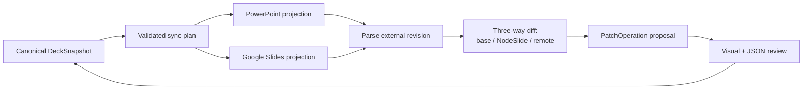

# NodeSlide

**Reviewable deck-as-code. Every AI edit is a scoped, validated, receipted proposal — never a silent overwrite.**

[**Live demo →**](https://parity-studio.vercel.app/?domain=nodeslide) · React 19 + Convex + Vite · [`agentic-ui-qa`](https://github.com/HomenShum/agentic-ui-qa)-audited · Built for the AI Fund SlideLang EIR Build Challenge

> NodeSlide turns a prompt, a structured brief, or raw data into a presentation you can *inspect and defend* — a canonical structured document that compiles to editable slides, where every change (human or agent) flows through one validated mutation path.

> **Repository status (2026-07-13):** this is the fresh public home for NodeSlide, seeded docs-first. The product runs today at the [live demo](https://parity-studio.vercel.app/?domain=nodeslide); the source is being extracted from the `parity-studio` monorepo into this repo with an IP-carve-out and secrets pass, so the architecture links below currently point to the canonical source. See [Repository status](#repository-status).

---

## Why

Prompt-to-image slide tools shorten the first draft and then throw away the structure professionals need afterward. Numbers can't be inspected, charts can't be rebound to data, a layout defect is hard to repair, and every revision becomes another full generation request.

**A presentation should be a trustworthy, editable program — not an opaque image returned by a prompt.**

NodeSlide's wedge is **decks that must be defended**: diligence memos, operating reviews, investor and board material, technical explainers — recurring, evidence-heavy work where provenance and safe revision matter more than a one-off visual. The durable asset isn't a generated picture; it's an inspectable presentation program that humans and agents can evolve together.

## What it is

A canonical `nodeslide.slidelang/v1` **DeckSpec** is the single source of truth. Every slide and element carries a stable ID, normalized geometry, type-specific data, style, sources, export capabilities, and version clocks. Render targets (browser, HTML, PowerPoint) are *derived*, never the source.

```mermaid
flowchart LR
  P["Prompt · spec · data"] --> PLAN["Bounded planner"]
  PLAN --> SPEC["nodeslide.slidelang/v1<br/>DeckSpec"]
  SPEC --> ED["Browser editor"]
  ED -->|"human or agent edit"| PROP["Proposal<br/>EditOp[] + digest + scope"]
  PROP --> VAL["Server: validate ·<br/>CAS on baseVersion"]
  VAL -->|accept| VER["New canonical version"]
  VAL -->|reject / stale| PROP
  VER --> OUT["Present · Publish ·<br/>HTML · PPTX"]
```

That structure buys what a static slide image cannot: direct editing without regeneration, data-bound charts and preserved math, element- and slide-scoped AI operations, deterministic validation and repair, reviewable diffs and versions, multiple render targets from one deck, and immutable public publishing while private notes stay private.

## The single mutation path

Human edits and agent edits converge on **one** path. Nothing lands silently, and stale work can't overwrite newer state.

- Every edit — drag, resize, a Design control, an agent proposal, a repair — reduces to typed `PatchOperation[]`: `move`, `resize`, `replace_text`, `update_style`, `update_chart`, `update_image`, `add_element`, `remove_element`, `set_visibility`, `group`/`ungroup`, `reorder_element`, `update_slide`.
- The client can preview a candidate locally, but **acceptance is a server mutation**. `applyPatch` → `commitPatch` reconstructs the candidate, revalidates every op, checks scope and capability policy, recomputes the digest, and compares version clocks before writing a new version.
- **CAS on `baseVersion`** rejects stale writes and *rebases* fine-grained edits onto a newer deck version when their specific slides/elements were untouched. No client optimism — the server is the single source of truth.
- **Agent edits are proposals.** They land as `awaiting_review` with the exact operations, model attribution, token/cost usage, candidate digest, and a validation receipt — then a human accepts or rejects through the same gate.

## Capability matrix — honest status

Capability honesty is the product, so it's the README too. As of 2026-07-13:

| Workflow | State | Ease |
|---|---|:--:|
| NodeSlide → PowerPoint | One-click **editable** PPTX export (text, shapes, connectors, native charts, embedded images; math as editable text; video/remote-image as labeled fallbacks) | ✅ Good |
| PowerPoint → NodeSlide | **Design-signature extraction only** (colors, type, density) — does *not* reconstruct slides | ⚠️ Poor |
| NodeSlide → Google Slides | Manual: export `.pptx`, import into Google | ⚠️ Mediocre |
| Google Slides → NodeSlide | Not implemented | ❌ None |
| Ongoing PowerPoint / Google sync | Not implemented | ❌ None |
| Inspect agent changes | Proposal cards, before/after diff, trace telemetry, version compare/restore | ✅ Good |
| Full deck as user-facing JSON | Serializes faithfully **internally**; no view/edit/download surface yet | 🔶 In progress |
| Deck JSON import / download | Not shipped | 🔶 In progress |
| Full DeckSpec over MCP | MCP exposes bounded metadata, slides, traces, proposals — **not** the complete snapshot | ⚠️ Partial |

**PPTX export** is real and substantive, honestly labeled *"Editable PPTX with fallbacks"* in the toolbar. Fidelity loss (math-as-text, linked-video placeholder, un-fetched remote image) is disclosed as **blocking** export-validation warnings and surfaced in the Trace panel, not swallowed. The one inbound `.pptx` reader extracts *design taste*, not content — the "Upload a past deck" control means *import design style*, not import slides.

**Agent-mutated state is already fully modeled and round-trips.** `SlideElement` captures identity, geometry, rotation, content, style, chart data, math, images/credits, video, source bindings, lock/visibility, grouping, and version clocks; `applyDeckPatch` writes agent EditOps into exactly those fields. The gap is only the *user-facing* JSON surface — see the roadmap.

## Documentation

- [**Product Requirements (PRD)**](docs/PRD.md) — problem, user, workflow, why structured authoring wins, trust surface, launch requirements, metrics, wedge.
- [**Technical Design (TDD)**](docs/TDD.md) — architecture, canonical schema, agent execution, mutation protocol, validation/repair, rendering/export/publishing, MCP seam, verification.

## Architecture

React 19 + TypeScript + Vite editor over a **Convex** authoritative backend; PptxGenJS and a self-contained HTML compiler for export; [`pi-ai`](https://www.npmjs.com/package/@earendil-works/pi-ai) for governed model routing (managed Nebius GLM 5.2 + BYOK); JSZip + OOXML parsing for style extraction. Deployed on Vercel + Convex.

While the source migrates into this repo, these point to the canonical implementation in the `parity-studio` monorepo:

| Concern | Module (canonical source) |
|---|---|
| Canonical schema — `DeckSnapshot`, `SlideElement`, `PatchOperation`, `DeckPatch`, `DeckVersion` | [`shared/nodeslide.ts`](https://github.com/HomenShum/parity-studio/blob/main/shared/nodeslide.ts) |
| Pure apply core (`applyDeckPatch`) | [`shared/nodeslidePatch.ts`](https://github.com/HomenShum/parity-studio/blob/main/shared/nodeslidePatch.ts) |
| Server authority — `applyPatch` / `commitPatch`, CAS | [`convex/nodeslide.ts`](https://github.com/HomenShum/parity-studio/blob/main/convex/nodeslide.ts), [`convex/lib/nodeslidePatches.ts`](https://github.com/HomenShum/parity-studio/blob/main/convex/lib/nodeslidePatches.ts) |
| Durable agent — plan, propose, trace | [`convex/nodeslideAgent.ts`](https://github.com/HomenShum/parity-studio/blob/main/convex/nodeslideAgent.ts) |
| Compilers — PPTX, HTML, capabilities, validation | [`src/domains/nodeslide/slidelang/`](https://github.com/HomenShum/parity-studio/tree/main/src/domains/nodeslide/slidelang) |
| Inspectors — AI · Design · Data · Comments · Versions · Trace | [`src/domains/nodeslide/inspector/`](https://github.com/HomenShum/parity-studio/tree/main/src/domains/nodeslide/inspector) |
| Governed MCP surface | [`mcp/src/lib/nodeslideTools.ts`](https://github.com/HomenShum/parity-studio/blob/main/mcp/src/lib/nodeslideTools.ts) |

**Grounding tools.** Consented Linkup web research runs bounded searches, persists source snapshots, and attaches `{url, retrievedAt, excerpt}` citations to the claims they support. Data ingestion accepts CSV/JSON/TXT as typed source records (digest, columns, row count) that bind to chart and formula primitives, with per-source retention and deletion.

**Governed MCP.** A coding agent (Claude Code, Codex, Cursor) can drive NodeSlide through tools that mirror the same governed Convex actions — so every MCP write inherits the UI's consent, write-scope, propose-before-mutate, and receipt gates. Governance parity is the invariant: the second front door has the same locks.

## Interoperability roadmap

NodeSlide stays the canonical source of truth; PowerPoint and Google Slides are **synchronized projections**, not equal databases that silently overwrite each other. An inbound external edit never mutates the deck directly — it becomes the same validated, reviewable `PatchOperation` proposal the agent uses today.

Prioritized:

1. **Deck JSON surface + MCP parity** — a first-class *Source* panel (Structure · JSON · Changes) to view, copy, download, import, and validate the DeckSpec, plus full-snapshot access over MCP. Highest leverage, lowest risk: a UI over data that already serializes and round-trips.
2. **Capability-honest labels** — rename "Upload a past deck" to "Import design style from PPTX"; explicit math semantic-fidelity note.
3. **Full PPTX content import + re-import diff** — parse OOXML into primitives with a per-element `native / approximated / dropped` fidelity report; never claim a 1:1 import.
4. **Google Slides connector** — `presentations.batchUpdate` with `requiredRevisionId` guards, behind scoped OAuth; each push a propose→confirm action.
5. **Durable bidirectional sync + conflict management** — a per-connection sync ledger (provider, external ID, last-synced versions, ID mappings, prior snapshot, capability report).

*Editing source JSON must never bypass the mutation system:* saving compiles changes into `PatchOperation[]`, runs schema + layout validation, shows the visual diff, then requires acceptance. The foundational data model already supports all of this — the missing work is the connector layer, the sync ledger, and the source UI, not a schema rewrite.

## Trust & verification

Trust is a product surface, not a hidden backend step. Validation covers schema and referential integrity, bounds/overlap/text-fit, required chart/math data, safe media URLs, source coverage, export capability, and publication cleanliness — and it *blocks* unsafe present, publish, or export. Repairs are explicit proposals through the same gate.

- **500+ Vitest tests** across ~74 files: schema coercion, planner attribution, one-repair fallback convergence, acceptance gating, editor-state integrity, publishing privacy, web-research/ingestion contracts, governed-MCP consent parity, and HTML/PPTX generation. TypeScript compile and the Vite production build are release gates.
- **Independent UI audit** via the open-source [`agentic-ui-qa`](https://github.com/HomenShum/agentic-ui-qa) protocol — the Agentic UI Bar (B1–B11) for surface trust/operability and a Depth tier (D1–D11) for agent-product maturity — with findings tracked in an append-only ledger.

The Trace inspector exposes the exact provider/model, plan, tool calls, operations, validation state, digests, token/cost usage, and the human decision — a compact run-metrics card over an auditable events chain, closing on a validation seal honestly labeled by run type (countersigned for a live run, provisional for a deterministic one).

## Repository status

This repository is the fresh, public home for NodeSlide. It is currently seeded with the product documentation (PRD, TDD) and this overview. The running application lives at the [live demo](https://parity-studio.vercel.app/?domain=nodeslide) and its source in the `parity-studio` monorepo; migration into this repo is deliberate and staged:

1. **Docs + overview** — *done* (this commit).
2. **Source extraction** — lift `shared/nodeslide*`, `src/domains/nodeslide/`, the `convex/nodeslide*` server, and the MCP surface into a standalone, buildable package, with an IP-carve-out review (no out-of-scope Parity Studio platform IP) and a secrets scan.
3. **Standalone quickstart** — `npm install && npm run dev` against a fresh Convex deployment, with a deterministic (no-key) path for reproducible runs.
4. **CI + release gates** — typecheck, Vitest, production build, and the `agentic-ui-qa` audit.

## License

No open-source license is declared yet — absent a `LICENSE` file, all rights are reserved by default. This is intentional while the AI Fund EIR IP carve-out is settled; a license will be added deliberately. The [`agentic-ui-qa`](https://github.com/HomenShum/agentic-ui-qa) QA protocol referenced here is separately MIT.
