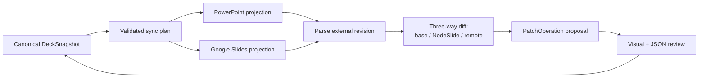

# NodeSlide

**Reviewable deck-as-code. Every AI edit is a scoped, validated, receipted proposal — never a silent overwrite.**

[**Live demo →**](https://nodeslide.vercel.app) · React 19 + Convex + Vite · [`agentic-ui-qa`](https://github.com/HomenShum/agentic-ui-qa)-audited · Built for the AI Fund SlideLang EIR Build Challenge

> NodeSlide turns a prompt, a structured brief, or raw data into a presentation you can *inspect and defend* — a canonical structured document that compiles to editable slides, where every change (human or agent) flows through one validated mutation path.

> **Repository status (2026-07-20):** the NodeSlide app lives in this repo and **builds green** — the Convex backend deploys, `tsc -b` passes, and **764 tests across 99 files** pass. Extracted from the `parity-studio` monorepo with an IP-carve-out + secrets pass. See [Repository status](#repository-status).

---

## Watch the full journey — 2 min 26 s, recorded live on production

https://github.com/HomenShum/NodeSlide/raw/main/docs/demo/nodeslide-demo-final.mp4

Six acts at [nodeslide.vercel.app](https://nodeslide.vercel.app), captured by a fail-closed recorder (every scene asserts real product state before its caption; a failed assert aborts the take — zero seeded or fabricated state):

1. **Fresh session** — a founder brief is typed and `pilot-metrics.csv` attached; the Kimi K3 · OpenRouter route is disclosed up front
2. **Live creation** — Kimi generates exactly the six requested slides from the brief (real elapsed 3 min 47 s, shown at 10×); the Trace receipt attributes the plan to the live model, no fallback
3. **Structured primitives** — the chart, formula, and image are each *clicked*, proving native editable elements; real art is uploaded with alt text and credit; the Evidence tab lists the attached CSV as a typed source
4. **Directed edit** — a plain-language ask lands in the conversational thread; Kimi returns a validated proposal; Accept applies one CAS-guarded change
5. **Non-text edit** — the chart is updated to the verified per-customer numbers from the attached data; the bars visibly change
6. **Ship** — validation gates green, editable PowerPoint exported, canonical JSON available

### The hero loop — 43 seconds, live agent, single take

https://github.com/HomenShum/NodeSlide/raw/main/docs/demo/agent-thread-live-kimi.mp4

Unedited recording against the deployed Convex backend and the live Kimi K3 route:

1. An instruction lands in the AI tab → the conversational thread echoes the turn in **under a second**
2. The agent researches and validates → a **cited, validated proposal** arrives in ~30s ("Ready for review · Kimi K3 · 1 source")
3. The canvas opens a **side-by-side Compare** — baseline vs proposal, the headline genuinely tightened
4. **Accept in place** → patch applies, deck version advances, provenance intact

Nothing in the agent loop is mocked. That clip is the product thesis: agent edits are reviewable diffs on a typed document, never silent overwrites.

---

## Why

Prompt-to-image slide tools shorten the first draft and then throw away the structure professionals need afterward. Numbers can't be inspected, charts can't be rebound to data, a layout defect is hard to repair, and every revision becomes another full generation request.

**A presentation should be a trustworthy, editable program — not an opaque image returned by a prompt.**

NodeSlide's wedge is **decks that must be defended**: diligence memos, operating reviews, investor and board material, technical explainers — recurring, evidence-heavy work where provenance and safe revision matter more than a one-off visual. The durable asset isn't a generated picture; it's an inspectable presentation program that humans and agents can evolve together.

## What it is

A canonical `nodeslide.slidelang/v1` **DeckSpec** is the single source of truth. Every slide and element carries a stable ID, normalized geometry, type-specific data, style, sources, export capabilities, and version clocks. Render targets (browser, HTML, PowerPoint) are *derived*, never the source.

```mermaid
flowchart LR
  P["Prompt · spec · data"] --> PLAN["Bounded planner"]
  PLAN --> SPEC["nodeslide.slidelang/v1<br/>DeckSpec"]
  SPEC --> ED["Browser editor"]
  ED -->|"human or agent edit"| PROP["Proposal<br/>EditOp[] + digest + scope"]
  PROP --> VAL["Server: validate ·<br/>CAS on baseVersion"]
  VAL -->|accept| VER["New canonical version"]
  VAL -->|reject / stale| PROP
  VER --> OUT["Present · Publish ·<br/>HTML · PPTX"]
```



That structure buys what a static slide image cannot: direct editing without regeneration, data-bound charts and preserved math, element- and slide-scoped AI operations, deterministic validation and repair, reviewable diffs and versions, multiple render targets from one deck, and immutable public publishing while private notes stay private.

## The single mutation path

Human edits and agent edits converge on **one** path. Nothing lands silently, and stale work can't overwrite newer state.

- Every edit — drag, resize, a Design control, an agent proposal, a repair — reduces to typed `PatchOperation[]`: `move`, `resize`, `replace_text`, `update_style`, `update_chart`, `update_image`, `add_element`, `remove_element`, `set_visibility`, `group`/`ungroup`, `reorder_element`, `update_slide`.
- The client can preview a candidate locally, but **acceptance is a server mutation**. `applyPatch` → `commitPatch` reconstructs the candidate, revalidates every op, checks scope and capability policy, recomputes the digest, and compares version clocks before writing a new version.
- **CAS on `baseVersion`** rejects stale writes and *rebases* fine-grained edits onto a newer deck version when their specific slides/elements were untouched. No client optimism — the server is the single source of truth.
- **Agent edits are proposals.** They land as `awaiting_review` with the exact operations, model attribution, token/cost usage, candidate digest, and a validation receipt — then a human accepts or rejects through the same gate.

## Capability matrix — honest status

Capability honesty is the product, so it's the README too. As of 2026-07-20:

| Workflow | State | Ease |
|---|---|:--:|
| NodeSlide → PowerPoint | One-click PPTX export (editable text, shapes, connectors, native charts, embedded images; typeset math as a rendered static fallback; video/remote-image as labeled fallbacks) | ✅ Good |
| PowerPoint → NodeSlide | **Design-signature extraction only** (colors, type, density) — does *not* reconstruct slides | ⚠️ Poor |
| NodeSlide → Google Slides | Manual: export `.pptx`, import into Google | ⚠️ Mediocre |
| Google Slides → NodeSlide | Not implemented | ❌ None |
| Ongoing PowerPoint / Google sync | Not implemented | ❌ None |
| Inspect agent changes | Proposal cards, before/after diff, trace telemetry, version compare/restore | ✅ Good |
| Full deck as user-facing JSON | Full-deck view/copy/download shipped; supported selection JSON edits become governed proposals; arbitrary full-snapshot editing remains partial | 🔶 In progress |
| Deck JSON import / download | Download shipped; import not shipped | 🔶 In progress |
| Full DeckSpec over MCP | MCP exposes bounded metadata, slides, traces, proposals — **not** the complete snapshot | ⚠️ Partial |

**PPTX export** is real and substantive, honestly labeled *"Editable PPTX with fallbacks"* in the toolbar. Valid math exports visibly as `pptx_static_fallback` and is non-editable; linked-video and unavailable remote-image paths remain explicitly labeled rather than swallowed. The one inbound `.pptx` reader extracts *design taste*, not content — the "Upload a past deck" control means *import design style*, not import slides.

**Agent-mutated state is already fully modeled and round-trips.** `SlideElement` captures identity, geometry, rotation, content, style, chart data, math, images/credits, video, source bindings, lock/visibility, grouping, and version clocks; `applyDeckPatch` writes agent EditOps into exactly those fields. The remaining JSON gaps are import, arbitrary full-snapshot editing, and full-snapshot MCP parity — see the roadmap.

## Documentation

- [**External-agent access**](docs/EXTERNAL_AGENT_ACCESS.md) - offline CLI and MCP file tools, host-backed MCP mode, proposal receipts, and tarball consumer proof.

- [**Product Requirements (PRD)**](docs/PRD.md) — problem, user, workflow, why structured authoring wins, trust surface, launch requirements, metrics, wedge.
- [**Technical Design (TDD)**](docs/TDD.md) — architecture, canonical schema, agent execution, mutation protocol, validation/repair, rendering/export/publishing, MCP seam, verification.

## Quickstart

```bash
git clone https://github.com/HomenShum/NodeSlide
cd NodeSlide
npm install
npx convex dev     # one-time: provisions a Convex deployment, writes .env.local, generates convex/_generated/
npm run dev        # vite + convex dev (concurrently) — open the printed localhost URL
```

The **deterministic path needs no API keys** and produces a complete, reproducible deck. For live model runs, set `OPENROUTER_API_KEY` in Convex (`npx convex env set OPENROUTER_API_KEY …`) or bring your own key (BYOK). See [`.env.example`](.env.example).

```bash
npm test            # vitest run — 764 tests across 99 files in the full CI corpus
npm run typecheck   # tsc -b
npm run build       # tsc -b && vite build
npm run lint        # biome check .
```

## Architecture

React 19 + TypeScript + Vite editor over a **Convex** authoritative backend; PptxGenJS and a self-contained HTML compiler for export; [`pi-ai`](https://www.npmjs.com/package/@earendil-works/pi-ai) for governed routing (Kimi K3 planning, Gemini 3.5 Flash execution, deterministic fallback, and BYOK paths); JSZip + OOXML parsing for style extraction. Deployed on Vercel + Convex.

Key modules:

| Concern | Module |
|---|---|
| Canonical schema — `DeckSnapshot`, `SlideElement`, `PatchOperation`, `DeckPatch`, `DeckVersion` | [`shared/nodeslide.ts`](shared/nodeslide.ts) |
| Pure apply core (`applyDeckPatch`) | [`shared/nodeslidePatch.ts`](shared/nodeslidePatch.ts) |
| Server authority — `applyPatch` / `commitPatch`, CAS | [`convex/nodeslide.ts`](convex/nodeslide.ts), [`convex/lib/nodeslidePatches.ts`](convex/lib/nodeslidePatches.ts) |
| Durable agent — plan, propose, trace | [`convex/nodeslideAgent.ts`](convex/nodeslideAgent.ts) |
| Compilers — PPTX, HTML, capabilities, validation | [`src/domains/nodeslide/slidelang/`](src/domains/nodeslide/slidelang) |
| Inspectors — AI · Design · Data · Comments · Versions · Trace | [`src/domains/nodeslide/inspector/`](src/domains/nodeslide/inspector) |
| Governed MCP surface | [`mcp/src/lib/nodeslideTools.ts`](mcp/src/lib/nodeslideTools.ts) |

**Grounding tools.** Consented Linkup web research runs bounded searches, persists source snapshots, and attaches `{url, retrievedAt, excerpt}` citations to the claims they support. Data ingestion accepts CSV/JSON/TXT as typed source records (digest, columns, row count) that bind to chart and formula primitives, with per-source retention and deletion.

**Governed MCP.** A coding agent (Claude Code, Codex, Cursor) can drive NodeSlide through tools that mirror the same governed Convex actions — so every MCP write inherits the UI's consent, write-scope, propose-before-mutate, and receipt gates. Governance parity is the invariant: the second front door has the same locks.

## Interoperability roadmap

NodeSlide stays the canonical source of truth; PowerPoint and Google Slides are **synchronized projections**, not equal databases that silently overwrite each other. An inbound external edit never mutates the deck directly — it becomes the same validated, reviewable `PatchOperation` proposal the agent uses today.



Prioritized:

1. **JSON import + full-snapshot MCP parity** — Source/JSON view, copy, download, validation, and supported selection editing already ship; add governed DeckSpec import, arbitrary full-snapshot editing, and complete snapshot access over MCP.
2. **Capability-honest labels** — rename "Upload a past deck" to "Import design style from PPTX"; explicit math semantic-fidelity note.
3. **Full PPTX content import + re-import diff** — parse OOXML into primitives with a per-element `native / approximated / dropped` fidelity report; never claim a 1:1 import.
4. **Google Slides connector** — `presentations.batchUpdate` with `requiredRevisionId` guards, behind scoped OAuth; each push a propose→confirm action.
5. **Durable bidirectional sync + conflict management** — a per-connection sync ledger (provider, external ID, last-synced versions, ID mappings, prior snapshot, capability report).

*Editing source JSON must never bypass the mutation system:* saving compiles supported changes into `PatchOperation[]`, runs schema + layout validation, shows the visual diff, then requires acceptance. The foundational model and bounded Source UI already support this path; the remaining work is import, arbitrary full-snapshot editing, full-snapshot MCP parity, connectors, and the sync ledger — not a schema rewrite.

## Built · Reused · Broke

The disclosure discipline from the AI Fund Build Challenge template, kept as a permanent README fixture — every showcase claim names its evidence.

**What I personally built.** The deck-as-code type system (`DeckSnapshot` — typed slides/elements/sources, normalized geometry, version clocks; render targets are derived, never the source). The patch/review model (`applyDeckPatch` — agent edits land as validated, reviewable patches with CAS version guards). The durable agent runtime on Convex (`nodeslide_agent_runs`/`_messages`/`_spans` — per-step model, token, and cost telemetry). The conversational review UI (`AgentThread` — visible tool steps, citations, accept-in-place).

**What I reused (disclosed).** React 19 / Vite / Convex / Tailwind; shadcn + Radix interaction primitives; Vercel AI Elements (prompt input, thread pieces); OpenRouter for model routing (Kimi K3 default). Reuse is a feature: the edge is the governance and proof glue, not re-implementing editors.

**What broke and how I debugged it.** The agent route itself. The default model route was dead (missing key + model absent from the client catalog), and Kimi K3 initially returned *empty content* — `reasoning: true` consumed the token budget before any text. Root-caused request-by-request against the OpenRouter API, registered the model with honest pricing so cost receipts are non-zero, promoted it to the validated default, pinned with tests. The demo video above is that same route working end to end; the failure, fix, and proof are all in this repo's git history.

## Trust & verification

Trust is a product surface, not a hidden backend step. Validation covers schema and referential integrity, bounds/overlap/text-fit, required chart/math data, safe media URLs, source coverage, export capability, and publication cleanliness — and it *blocks* unsafe present, publish, or export. Repairs are explicit proposals through the same gate.

- **764 Vitest tests across 99 files**: schema coercion, planner attribution, repair convergence, acceptance and authorization gating, editor-state integrity, publishing privacy, web-research/ingestion contracts, governed-MCP consent parity, HTML/PPTX generation, reusable-package conformance, and AgentThread review scenarios. TypeScript compile is a release gate; `npx impeccable detect` runs zero-findings on the agent UI surfaces.
- **Independent UI audit** via the open-source [`agentic-ui-qa`](https://github.com/HomenShum/agentic-ui-qa) protocol — the Agentic UI Bar (B1–B11) for surface trust/operability and a Depth tier (D1–D11) for agent-product maturity — with findings tracked in an append-only ledger.

The Trace inspector exposes the exact provider/model, plan, tool calls, operations, validation state, digests, token/cost usage, and the human decision — a compact run-metrics card over an auditable events chain, closing on a validation seal honestly labeled by run type (countersigned for a live run, provisional for a deterministic one).

## Repository status

This repository is the public home for NodeSlide, extracted from the `parity-studio` monorepo.

1. **Docs + overview** — ✅ done.
2. **Source extraction** — ✅ done. `shared/nodeslide*`, `src/domains/nodeslide/`, the `convex/nodeslide*` server (schema scoped to the standalone product), and the MCP tools lifted into a standalone, buildable package. IP-carve-out verified (no Parity Studio platform IP; the frontend imports zero shell components) and secrets-scanned (none found).
3. **Standalone build** — ✅ green. Convex backend deploys; `tsc -b` + `vite build` pass; **764 Vitest tests across 99 files** pass; biome clean.
4. **CI + release gates** — ✅ typecheck, Vitest, build, runtime smoke, MCP, node-platform conformance, and packed NodeRoom/NodeAgent consumer checks run in CI. Scheduled production probing is also present; automatic production deployment still awaits repository secrets/environment configuration.

The dedicated **live demo** is [nodeslide.vercel.app](https://nodeslide.vercel.app), backed by the production Convex deployment.

## License

No open-source license is declared yet — absent a `LICENSE` file, all rights are reserved by default. This is intentional while the AI Fund EIR IP carve-out is settled; a license will be added deliberately. The [`agentic-ui-qa`](https://github.com/HomenShum/agentic-ui-qa) QA protocol referenced here is separately MIT.
