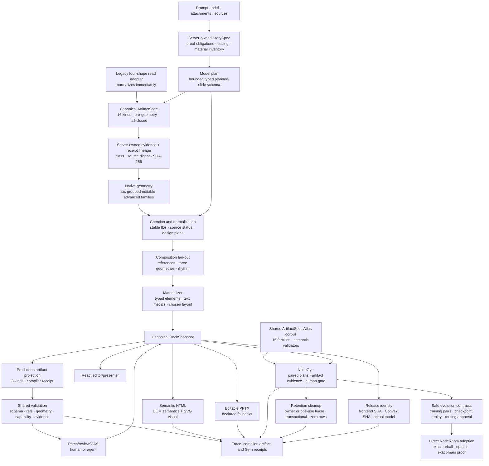

# From compact JSON to governed, semantic HTML

This document records how NodeSlide's authoring representation evolved from a
compact slide JSON file into the current governed pipeline:

```text
brief + evidence
→ server-owned StorySpec + material inventory
→ bounded typed planned-slide spec
→ per-slide design plans + composition fan-out
→ normalized canonical DeckSnapshot
→ production artifact projection + semantic compiler receipt
→ validation and bounded typed repair
→ browser editor / semantic HTML / editable PowerPoint
→ immutable NodeGym/Atlas receipts and human review
```

It is deliberately a challenge-and-resolution history. A successful HTML file
was never the entire goal. The harder problem was preserving intent, evidence,
editability, accessibility, concurrency safety, and cross-format honesty while
people and multiple models continued changing the deck.

## History boundary

NodeSlide began inside `parity-studio` and was extracted into this standalone
repository on 2026-07-13. The predecessor history starts with
`61dac11` (`feat: launch NodeSlide private preview`) on 2026-07-10. The first
standalone source snapshot is `ac66f88`.

Therefore:

- hashes dated 2026-07-10 through the early 2026-07-13 work refer to the
  predecessor repository;
- hashes from `ac66f88` onward refer to this repository;
- the standalone extraction is not presented as the invention date for code
  that already existed in the predecessor.

## The original source shape

The first source project used compact `.sl.json` files. A slide declared a
fixed 1440 × 810 frame, then encoded boxes, text, and connectors as positional
arrays:

```json
{
  "v": "sl0",
  "fr": [1440, 810, 18],
  "meta": { "id": "slide_00", "title": "Living decks, built together" },
  "tx": [
    [
      "s00_title",
      88,
      185,
      760,
      170,
      "ttc",
      "Living decks,\nbuilt together",
      null,
      { "fs": 72, "ta": "l", "c": "#14213D", "ml": 2, "lh": 0.98 }
    ]
  ]
}
```

This was compact and deterministic, but it was not a good collaborative state
model:

- array position carried meaning;
- tokens such as `ttc`, `fs`, `ta`, and `ml` required compiler knowledge;
- geometry was bound to one pixel frame;
- relationships were string conventions rather than typed records;
- the format did not itself provide element clocks, scoped mutations, source
  lineage, accessibility contracts, or per-target capabilities.

The key decision was not to keep adding fields to this compact render format.
NodeSlide introduced a separate, explicit canonical document and treated HTML,
SVG, and PowerPoint as derived projections.

## The canonical shape that replaced it

The corresponding canonical element became self-describing and mutable by
stable identity:

```json
{
  "id": "element:headline",
  "slideId": "slide:overview",
  "name": "Headline",
  "kind": "text",
  "role": "title",
  "bbox": { "x": 0.06, "y": 0.07, "width": 0.62, "height": 0.14 },
  "rotation": 0,
  "content": "Editable native headline",
  "style": {
    "fontFamily": "Aptos Display",
    "fontSize": 40,
    "fontWeight": 700
  },
  "sourceIds": ["source:adoption"],
  "locked": false,
  "exportCapabilities": ["web_native", "pptx_editable"],
  "version": 1
}
```

The document is split into `deck`, `slides`, `elements`, and `sources`. Stable
IDs and normalized `0..1` geometry make an element addressable across browser
rendering, editing, revisions, evidence, HTML, and PowerPoint.

The HTML compiler then derives both a visual projection and a semantic
projection:

```html
<section data-slide-id="slide:overview" role="region">
  <div class="slide-semantics">
    <h2>Slide 1 of 1: Overview</h2>
    <h3 data-element-id="element:headline">Editable native headline</h3>
  </div>
  <svg data-slide-visual aria-hidden="true" viewBox="0 0 1440 810">
    <!-- visual shapes derived from the same element records -->
  </svg>
</section>
```

The semantic layer is not a second authored deck. It is generated from the
same snapshot and carries stable element/source IDs, meaningful headings,
lists, chart tables/summaries, media descriptions, math descriptions, and
source records.

## Evolution map

```mermaid
flowchart LR
  A["sl0 compact JSON<br/>positional arrays + pixels"]
  B["DeckSnapshot v1<br/>typed records + stable IDs"]
  C["Patch protocol<br/>scope + CAS + review"]
  D["Structured primitives<br/>chart · image · diagram · math · video"]
  E["Materializer<br/>brief/model plan → elements"]
  F["Shared validation<br/>text metrics + geometry + capabilities"]
  G["Semantic HTML<br/>accessible DOM + SVG visual"]
  H["Render-aware creation<br/>critique + candidate repair"]
  I["StorySpec/design plans<br/>materials + references + fan-out"]
  J["Offline ArtifactSpec<br/>16 semantic families + receipts"]
  K["Production artifact boundary<br/>16-kind authored intent + 8-kind projection"]
  L["NodeGym<br/>paired plans + executable harnesses"]
  M["Portable Gym core<br/>install + upgrade proof"]
  N["Receipt security + native geometry<br/>evidence classes · SHA-256 lineage · six families"]
  O["Retention-safe UI evidence<br/>browser · PPTX · PDF · montage · zero rows"]
  P["Direct NodeRoom + governed evolution<br/>exact tarball · training pair · checkpoint · routing"]

  A --> B --> C --> D --> E --> F --> G --> H --> I --> J --> K --> L --> M --> N --> O --> P
```



## Chronological ledger

| Stage | Challenge exposed | Resolution and invariant gained | Traceable history |
|---|---|---|---|
| 0. Compact source files | Positional JSON was concise but opaque, pixel-bound, and difficult to patch safely. | Keep the compact format as an input/compiler proof; introduce a self-describing canonical state instead of using render syntax as application state. | predecessor `61dac11` |
| 1. Canonical document and projections | Browser, HTML, and PPTX could drift if each became editable state. | `nodeslide.slidelang/v1` `DeckSnapshot` became the sole source; every target is derived. Stable IDs, normalized geometry, explicit style/data/source fields, and capability declarations entered the contract. | predecessor `61dac11`; standalone `ac66f88` |
| 2. Authoritative mutation | Direct JSON or DOM edits could bypass scope, overwrite concurrent work, or make agent changes invisible. | Human and agent changes compile to typed `PatchOperation[]`; server validation, scope checks, locked-element rules, base versions, per-record clocks, CAS/rebase, review, and immutable versions control mutation. | predecessor `7ef593d`; retained in `ac66f88` |
| 3. Structured primitives | Text boxes could describe a chart or process without creating an editable artifact. | Add typed chart/image records, then editable diagram nodes/connectors, math, video, grouping, and target-specific capability reports. A requested artifact must exist as the correct primitive. | predecessor `934f217`, `1d4e0b5`, `80787b6`; standalone `5b0faac`, `46eebaa` |
| 4. Inspectable JSON | A canonical JSON source was only useful to developers if users could not see it; arbitrary JSON writes were unsafe. | Add a JSON inspector and download; supported selection edits are parsed into governed patch operations and previewed. Full-snapshot arbitrary editing remains deliberately incomplete. | predecessor `676d82c`; standalone `4874005`, `8287128` |
| 5. Prompt/model plan to elements | Model prose was variable, could ignore slide counts, and could invent unsupported structures. Fixed-coordinate materialization made the same design repeatedly. | Bound the planning schema, sanitize/coerce fields, enforce requested 6–8 slide counts, materialize stable IDs deterministically, limit primary artifacts, and retain deterministic fallback. | predecessor `bb6d09e`, `934f217`, `74679d3`; standalone `8501f00`, `5339d59` |
| 6. Layout correctness | Fixed heights and simple stacking caused body/bullet collisions, text overflow, and opening-slide failures. Browser and server could disagree about whether a deck was clean. | Add text-height estimation, auto-nudge/reflow, shared geometry checks, and materialization-time failure. The same issue logic is used by server, browser, export, and tests. | `0aab113`, `a0d34f9`, `2e8ce2d` |
| 7. Layout monotony | A clean deck could still be the same editorial card repeated. Counting slides was not visual authorship. | Select archetypes from narrative/content shape; later require rhythm, distinct composition signatures, structured diagrams, and complete-deck review. | `9fc0d24`, `76a6623` |
| 8. HTML semantics and safety | A visual SVG alone is inaccessible; raw strings can create injection risk; media and citations can disappear from exports. | Generate parallel semantic DOM, escape all authored data, sanitize font families, embed source records safely, mark decoration, expose chart data as tables/summaries, and keep media/source fallbacks explicit. | predecessor `61dac11`; expanded in standalone `46eebaa`, `82fe487`, `bbf4aaf` |
| 9. Cross-format fidelity | Browser-native features do not automatically remain editable or truthful in PowerPoint. Remote images could be dropped and math could be mislabeled as editable text. | Maintain per-element capability reports; use native PowerPoint charts/shapes/connectors where possible; use declared static fallbacks for rendered math; embed approved images; record known fidelity differences. | predecessor `21f2b23`; standalone `5e4b1fb`, `9141672`, `9e81653`, `b8c9d30` |
| 10. Render-aware repair | Schema-valid JSON can still render badly. Initially, repair libraries existed without a live caller; later, creation could pass without exercising the revision branch. | Render and validate real candidates, retain attempt/digest receipts, derive typed repairs, preserve the base, and accept a revision only when its concrete issue report improves. Use synthetic faults only in explicitly dev-only acceptance. | predecessor `71d2e2f`; standalone `a99edcd`, `4bb122a` |
| 11. Story and visual materials | The model could claim screenshots/traces it did not have and choose artifacts without an explicit narrative job. | Build a server-owned `StorySpec`, proof obligations, pacing, and material inventory with `available`, `constructible`, `placeholder`, and `missing`; add per-slide design plans, bounded references, composition fan-out, and fail-closed candidate selection. | `76a6623` |
| 12. Evidence lineage | `sourceIds` alone did not prove that a visible claim matched a captured excerpt or region. | Preserve immutable source/snapshot context, bind claims to excerpts/regions, show citing elements, and keep missing capture states honest across browser and export. | `bbf4aaf`, `14dce0e`, `52e989f`, `955fbdb` |
| 13. Model/harness evaluation | One good deterministic deck or one model run could be mistaken for general capability. Overflow-clean output could still contain wrong equations, malformed diagrams, or stale evidence. | Add Artifact Atlas, paired Model Arena receipts, exact model attribution, costs, browser/PPTX pixels, and human-review gates. The V2 audit then correctly reopened semantic eligibility rather than treating file existence as visual approval. | `d53f1dc`, `7003dc1`; `docs/ARTIFACT_SEMANTICS_MODEL_GYM_GOAL.md` |
| 14. Shared semantic ArtifactSpec | A render receipt could be green while arithmetic, graph direction, evidence freshness, or cohort definitions were wrong. | Define `nodeslide.artifact-spec/v1` as a 16-kind semantic contract; validate normalized payloads and provenance; bind all 38 Atlas artifacts to spec, receipt, source, and visual-inspection digests; add a tested 23-entry V2 issue-to-slide/artifact/validator/repair ledger; then reuse the same browser-safe runtime registry in Atlas, NodeGym, Convex, and provider schemas. | `shared/nodeslideArtifactRegistry.js`, `shared/nodeslideArtifactSpec.schema.json`, `scripts/lib/artifact-spec-core.mjs`, `docs/demo/nodeslide-artifact-semantics-v3/v2-issue-ledger.json` |
| 15. Authored intent versus downstream projection | The first production projection and Atlas spec were structurally incompatible but briefly risked sharing one name/version. Post-hoc reconstruction also could be mistaken for model intent. | Make the 16-kind canonical spec the task-scoped provider/tool boundary before geometry; normalize the old four-shape version only through a legacy read adapter; persist authored identity/provenance/claims/sources/digest/fidelity; retain the distinct eight-kind downstream projection for materialized-output validation. Unknown versions, kinds, refs, shapes, and promoted truth states fail closed. | `convex/lib/nodeslideAuthoredArtifact.ts`, `shared/nodeslideArtifactRegistry.js`, `shared/nodeslideArtifactSpec.ts`, `docs/PRODUCTION_ARTIFACT_BOUNDARY.md` |
| 16. Executable NodeGym | Labels such as “heavy harness” did not prove that a different prompt, context, tool policy, or repair loop actually ran. Odd subset limits and a model-inclusive pairing key also made valid model comparisons impossible. | Compile five immutable harness profiles into executable contracts; separate model comparison keys from exact harness-pair keys; refuse unmatched pairs; load four protected task pools through digest-bound runtime fixtures; retain every red attempt rather than rewriting it. | `scripts/lib/node-gym-harness-core.mjs`, `scripts/lib/node-gym-task-core.mjs`, `scripts/lib/node-gym-runner-core.mjs` |
| 17. Evidence-grade Gym receipts | Provider success text did not prove the returned upstream route, normalized spec, numeric facts, browser/PPTX/PDF parity, or model quality. Training export could also leak private or holdout data. | Adapt executor output into one canonical receipt; validate actual route, claim/fact bindings, per-slide renders, montage, PDF/PPTX/browser lineage, paired deltas and confidence intervals; generate anonymized blind-review packets; fail training export on missing consent/license/provenance, secrets/PII, deletion, duplicate, or holdout contamination. | `packages/gym-core/`, `scripts/lib/node-gym-evaluation-core.mjs`, `scripts/lib/node-gym-training-core.mjs` |
| 18. Portable NodeGym core | App-local experiment types could drift from NodeKit consumers and an “upgrade” could mean only a changed version string. | Extract dependency-free `@nodekit/gym-core`; pack exact `0.0.1` and `0.1.0` tarballs; verify SHA/integrity/lock pins, declarations, runtime exports, clean install, and upgrade in isolated NodeSlide and NodeRoom-domain consumers. Keep that isolated proof distinct from direct repository adoption. | `packages/gym-core/`, `scripts/node-gym-portability-proof.mjs`, `artifacts/node-gym/node-gym-core-portability-proof.json` |
| 19. Direct NodeRoom Gym consumer adoption | An isolated fixture could pass while the real NodeAgent product contract, authorization posture, exact package bytes, or repository gates failed. The user's active NodeRoom checkout also contained unrelated work. | Build in a separate clean NodeRoom worktree; pin exact `@nodekit/gym-core@0.1.0` bytes; implement a room-change-review evaluator and six-run/three-pair HOLD journey; prove no auto-apply/user mutation; run both required NodeAgent smokes and the complete repository floor. NodeSlide CI packs the candidate, NodeRoom stages the byte-identical tarball and lock integrity, runs `npm ci`, and invokes direct `nodegym:consumer:proof`. Adoption PR #242 and Node 24 hardening PR #243 are merged with green exact-main CI/conformance/ProofLoop; the unrelated dirty checkout remains untouched. | NodeRoom receipt `docs/eval/node-gym-consumer-proof.json`; package SHA-256 `b8c14013a54fc7419ebfda806553573c4b6e3d1dde2a17f11a61f5ddd88fc0c2`; NodeRoom mains `c9b699f416a68dfe29298d62b6559690c7ccaa6a` and `83f9b7442065652208f3a641e65bfed2752d5d13` |
| 20. Evidence-class and receipt security | A brief, success criterion, or unfetched link could be promoted to observed evidence; a model/client could also submit a plausible-looking receipt detached from the compiled artifact. | Make evidence class server-owned; require immutable upload/runtime receipts for observed claims; validate safe HTTPS/source URLs and exact receipt digests; bind authored spec, geometry, base input, materialization, projection, and render handle with SHA-256; reject mismatched lineage and strip model-authored receipts from public/client copies. | `convex/lib/nodeslideAuthoredArtifact.ts`, `shared/nodeslideArtifactRegistry.js`, `convex/lib/nodeslideData.ts` |
| 21. Native advanced geometry | A typed waterfall, Sankey, Gantt, risk matrix, trace, or spatial scene could still collapse into a generic chart/diagram and lose its visual grammar. | Compile the six families before generic fallback into source-bound grouped editable shapes, connectors, and text. One artifact identity and geometry digest travel through the downstream compiler; focused HTML/PPTX proof verifies a waterfall remains semantic in HTML and editable PowerPoint shape XML rather than chart fallback. | `shared/nodeslideArtifactGeometry.js`, `convex/lib/nodeslideAuthoredArtifact.ts`, `shared/nodeslideArtifactSpec.ts` |
| 22. Evidence-complete, retention-safe UI runs | A combined screenshot or successful export could hide missing slides/formats, and protected production probes could leave private decks and sources behind—especially if the create response was lost before the runner learned an owner key. | Emit real file bytes and SHA-256 for editor, per-slide browser, PPTX render, exact-PDF pages, montage, normalized specs, claims/facts, source lineage, route/harness trace effects, and cleanup. Gym runs retain owner-authenticated transactional deletion. The production probe binds a one-use cleanup lease before submit, persists only its digest + expiry, deletes by digest + client session, and has a bounded expiry sweeper. Missing evidence/cleanup or any remaining deck/source/project row fails the run. | `scripts/node-gym-ui-executor.mjs`, `scripts/lib/node-gym-ui-evidence-core.mjs`, `convex/nodeslideRetention.ts`, `convex/lib/nodeslideProductionProbe.ts` |
| 23. Training, checkpoint, and routing boundaries | “Self-improvement” risked collapsing accepted/rejected data, checkpoint training, shadow evaluation, and production routing into one unsafe switch. | Add versioned training-pair construction, provider-neutral fake-checkpoint replay with held-out identity checks, governed route selection with budgets/circuits/exact approval receipts, and typed escalation. External checkpoint training throws without separate authorization; shadow stays invisible and routing mutation is false unless an exact production approval is supplied. | `packages/gym-core/src/checkpoint.ts`, `packages/gym-core/src/routing.ts` |
| 24. Remote-media privacy | Treating every syntactically valid HTTPS image/video as renderable could leak viewer IP/referrer/cookies, probe private hosts, or make an export depend on mutable remote bytes. | Permit only bounded embedded raster data in persisted/rendered output; withhold remote images in browser/package/HTML/PPTX; instantiate remote video/poster/captions only after an explicit click; reject private/credential hosts. Openverse search is consented metadata-only, derives its own thumbnail endpoint from a bounded id, requires supported commercial-license metadata, fetches without credentials/referrer, rejects redirects, and enforces a streaming byte cap before embedding. | `shared/nodeslide.ts`, `src/domains/nodeslide/components/SlideRenderer.tsx`, `packages/react/src/viewer.tsx`, `src/domains/nodeslide/slidelang/html.ts`, `convex/lib/nodeslideImageSearch.ts` |
| 25. Exact deployment and model identity | A green local build, canonical URL, or requested router alias could be mislabeled as proof of the bytes/backend/model that actually ran. Embedding a “final SHA” in that same commit would also be self-invalidating. | Bind the frontend meta tag and compiled Convex query to one exact 40-character SHA; require a successful trusted exact-main deployment run and canonical production origin before probes; hash live JS/CSS; reject wrong Convex/Vercel project scopes. Separate eight production-enabled routes from five free qualification candidates and require provider-returned actual provider/model attribution. Append final run URLs to the merged PR/workflow artifacts, not a new commit that changes the SHA. | `.github/workflows/deploy-production.yml`, `scripts/lib/production-deployment-identity.mjs`, `convex/nodeslideBuildIdentity.ts`, `scripts/lib/model-fleet-receipt-core.mjs` |

## Detailed challenges and resolutions

### 1. Render syntax was the wrong database

The compact `sl0` source was useful for authoring and compiler proof because it
was dense and deterministic. It was a poor authoritative collaboration model:
changing array position could change meaning, normalized resizing required
conversion, and an agent could not safely say “replace this headline if its
version is still 3.”

Resolution:

- separate `Deck`, `Slide`, `SlideElement`, and `SourceRecord` collections;
- give every record a stable public ID and version;
- use normalized geometry independent of the output frame;
- store type-specific data (`chart`, `math`, `image`, `video`) beside common
  identity, style, provenance, locking, and capability fields;
- derive render syntax from canonical state.

The invariant is: **no browser DOM, HTML file, SVG path, or PowerPoint object is
the editable source of truth.**

### 2. “Editable JSON” could not mean “replace the database blob”

Direct snapshot writes would have bypassed scope, comments, review, version
clocks, validation, and agent attribution. The JSON inspector therefore evolved
in two steps: first visible/copyable/downloadable canonical state, then bounded
editing of supported selected-element fields.

Resolution:

```text
JSON edit
→ parse and validate supported fields
→ compile PatchOperation[]
→ candidate preview
→ server scope/CAS/semantic validation
→ explicit acceptance
→ new canonical version
```

Arbitrary full-snapshot import/editing remains open because pretending it is
safe would violate the single mutation path.

### 3. A type name did not prove an artifact existed

Early decks could use prose or generic shapes where the narrative required a
chart or diagram. Later tests also revealed the inverse problem: captions and
receipts could claim an artifact that the rendered slide did not visibly show.

Resolution:

- typed primitive data and validators;
- renderer and PowerPoint adapters for the same primitive;
- artifact-presence gates against rendered output;
- native editability checks and explicit static/unsupported fallbacks;
- stable source bindings on the artifact itself.

This moved NodeSlide from “JSON describing a slide” to “JSON describing
inspectable presentation objects.”

### 4. Fixed geometry made valid JSON visually invalid

The original materializer chose fixed boxes for headline, body, bullets,
metrics, and charts. Longer copy or an opening visual could collide even when
every value passed the schema.

Resolution:

- estimate rendered text height from font, width, content, and line-height;
- compute body and bullet positions from measured budgets;
- validate geometry before persistence;
- auto-nudge or reflow bounded cases;
- share the same geometry implementation between server and client.

The failed assumption was that normalized coordinates alone created responsive
composition. They did not; content-aware measurement was required.

### 5. Geometry correctness did not create good visual storytelling

Twenty geometry-clean generations proved publishability, but not visual
richness. The same arrangement could be emitted under several archetype labels,
and a sequence of individually clean slides could still feel repetitive.

Resolution:

- choose layout archetypes from slide job and content shape;
- add semantic archetypes and dominant visual centers;
- require editable structured diagrams for relationship-heavy claims;
- detect repeated composition signatures and text-dominant runs;
- fan out materially different candidate geometries;
- review the complete thumbnail strip and exported PowerPoint.

The newer Atlas audit added a further correction: even attractive variety does
not prove diagram semantics, arithmetic, or evidence truth.

### 6. Browser HTML needed two simultaneous representations

A slide is spatial, but a screen reader and search/indexing system need a
meaningful document order. Making the SVG accessible directly would have
produced a noisy collection of decorative paths and disconnected text.

Resolution:

- render the visible slide as SVG/HTML media from normalized geometry;
- render a parallel visually hidden semantic tree from the same ordered
  elements;
- represent headings, paragraphs, lists, figures, tables, math, media, and
  sources using appropriate HTML structures;
- keep the visual SVG `aria-hidden` and decoration excluded;
- retain `data-slide-id`, `data-element-id`, `data-element-kind`, and
  `data-source-ids` in both debugging and evidence surfaces;
- escape authored content and serialize embedded source JSON so `</script>` and
  related characters cannot break the document.

This is why NodeSlide calls the export semantic HTML rather than an SVG dump.

### 7. One canonical state did not guarantee cross-format parity

HTML can play video and typeset KaTeX; PowerPoint has different native
capabilities. A renderer that silently rasterized or dropped content would make
the canonical JSON misleading.

Resolution:

- compute declared and effective capability reports per element;
- export text, shapes, connectors, and supported charts as native PowerPoint
  objects;
- render valid math to a declared static fallback;
- embed approved images instead of depending on remote availability;
- label video and unsupported paths explicitly;
- record the browser-versus-PowerPoint difference in receipts.

The invariant is semantic honesty, not impossible pixel identity.

### 8. Validation needed to consume rendered facts

Schema validators can prove types, references, and ranges. They cannot prove
that text fits in the chosen font, a chart is visible, or a model-generated
repair improved the pixels.

Resolution:

- use deterministic structural validation before render;
- render the real canonical candidate;
- observe geometry/artifact presence and generate concrete issue codes;
- apply only bounded typed repair proposals;
- retain attempt and digest lineage;
- require strict improvement before adopting a model revision;
- keep unrepaired candidates and red receipts instead of rewriting history.

The next semantic validators extend this principle to arithmetic, graph
direction, Sankey conservation, evidence MIME/version binding, and comparison
cohort compatibility.

### 9. Model output needed server-owned context and normalization

Prompt-only generation invited several failure classes: ignored slide counts,
invented evidence, unsupported artifact requests, provider-specific JSON quirks,
and long-tail timeouts.

Resolution:

- bounded response schemas and field coercion;
- explicit slide-count requirements and server verification;
- route-specific reasoning and time budgets;
- deterministic fallback that is labeled as such;
- server-owned StorySpec and material status that model output cannot promote;
- design plans and reference IDs chosen by the server;
- creation critique and one bounded improving revision.

This is the bridge from an unconstrained language-model response to dependable
canonical JSON.

### 10. Receipts themselves became part of the correctness problem

Artifact Atlas V2 proved that a receipt can be structurally complete and still
be epistemically wrong. Its finalizer treated the existence of rendered files
as a visual pass, so wrong arithmetic and misleading diagrams appeared green.

Resolution implemented at the offline evaluation boundary:

- separate syntactic render, geometry, semantic validity, evidence validity,
  accessibility, cross-format fidelity, and human preference;
- bind each stage to input/output digests and issue codes;
- never let a later stage overwrite an earlier failure;
- define 16 typed `ArtifactSpec` families and deterministic semantic validators;
- bind the repaired 38-artifact museum to its source, spec, receipt, and visual
  inspection digests;
- compare model/harness pairs only on matched tasks, evidence, budgets, and
  repeated runs.

The human taste gate remains independent: a mechanically and semantically clean
artifact is eligible for review, not automatically preferred or released.

### 11. One “ArtifactSpec v1” could not describe incompatible boundaries

The 16-kind Atlas contract began as an offline semantic evaluator while the
production editor received legacy model deck JSON and persisted `DeckSnapshot`
elements. Calling a post-materialization reconstruction by the same version
would have implied interchangeability and model authorship that did not exist.
The fix was not to keep two semantic systems forever; it was to share the
authored semantic boundary while preserving a separate version for derived
materialized output.

Resolution:

- make `nodeslide.artifact-spec/v1` the shared 16-kind runtime/provider/tool
  contract used by Atlas, NodeGym, Convex, and task-scoped provider schemas;
- keep `nodeslide.production-authored-artifact/v1` only as explicit read
  compatibility for four historical shapes, normalizing immediately;
- resolve authored source refs against the server-owned brief/material inventory
  and compile canonical intent into existing planned primitives before geometry;
- persist the normalized spec plus a digest-bound receipt in creation state, and
  bind authored identity, narrative job, claims, sources, truth, rationale,
  digest, and fidelity to the primary materialized elements;
- derive the distinct eight-kind `nodeslide.production-artifact-spec/v1` from
  the materialized snapshot for semantic validation and export gating;
- retain `nodeslide.production-artifact-binding/v1` for graph node/edge roles,
  reuse canonical graph identity, and bind all authored primary elements through
  `nodeslide.authored-artifact-binding/v1`;
- classify source evidence before compilation: brief and success-criteria text
  remain instruction/criteria, unfetched links remain unobserved, and only an
  immutable upload or runtime receipt can support an observed claim;
- bind the exact authored spec, accepted legacy recovery, source receipt digest,
  native geometry, base input, materialization, downstream projection, render
  handle, and final receipt with SHA-256 lineage checks;
- reject unknown versions/kinds/shapes, provenance promotion, unsafe URLs,
  mismatched receipt digests, and public/client receipt injection. A storage-only
  migration reads the short-lived legacy binding version, while public writes
  accept only the production version and strip model-authored receipts.

The architecture gate is now closed, but the fidelity boundary remains precise.
Every kind maps to a native primitive, semantic adapter, summary fallback, or
declared static fallback. Waterfall, Sankey, Gantt, risk-matrix, trace, and
spatial-scene now compile into source-bound grouped editable shape, connector,
and text geometry before generic fallback. This closes their previous generic-
adapter gap; it does not invent every research-grade field. Proportional-width,
unit-algebra, crossing, raw-statistic, and capture-freshness depth still require
their own validators. Any remaining fallback is shipped behavior, not proof of
native editability or complete scientific semantics. The downstream receipt is
useful production coverage but is still not model intent.

### 12. “Different harness” had to mean different executable behavior

The first Gym matrix named light and structured harnesses, but a label alone
cannot establish causality. Pairing also conflated two questions: a harness
comparison must hold the model constant, while a model comparison must hold the
harness constant.

Resolution:

- compile `light-director`, `structured-planner`, `bounded-executor`,
  `repair-specialist`, and `router-robustness` into immutable prompt, context,
  tool, response-schema, and repair contracts;
- use one comparison key for distinct models under the same harness and a
  stricter model-inclusive key for distinct harnesses under the same model;
- split bounded subsets without orphaning one side of a pair;
- validate the requested and actually returned provider/model route;
- load public-development fixtures from the repository, but require
  hidden-validation, rotating-challenge, and live-shadow payloads at runtime;
  only their sealed digests enter committed configuration;
- bind the persisted matrix to the SHA-256 of the exact raw configuration bytes
  and require its complete ordered run list to equal deterministic regeneration;
- on resume, validate every immutable historical receipt before trusting it and
  count paid failed attempts toward cumulative cost/failure limits before any
  new provider call is scheduled;
- retain every attempt and red receipt under a campaign digest so a retry cannot
  rewrite experimental history.

The current configuration validates to 720 plans (8 tasks × 6 model/router
cohorts × 5 harnesses × 3 repetitions). That number describes the immutable
matrix only; it is not evidence that 720 live runs completed.

### 13. Scores needed to be bound to observable facts and artifacts

A provider response saying it succeeded is not a semantic or visual result.
Likewise, one combined screenshot cannot prove every slide, PowerPoint, PDF,
and browser output share the same source.

Resolution:

- validate the normalized ArtifactSpec and bind numeric/claim scores to fixture
  facts and source IDs;
- require exact upstream attribution when the route is a router;
- bind per-slide images, montage, browser render, PPTX, PDF, source lineage, and
  cross-format digests in the evaluation receipt;
- compute matched paired deltas with confidence intervals and capability cards
  by model × harness × role × task class;
- generate anonymized blind-review packets that remain
  `awaiting-human-review`; no automated score fabricates taste;
- keep champion/challenger output advisory and `autoApply: false`.

The retained zero-cost free-route attempts are honest red evidence: some
produced files but lacked complete route/spec/cross-format attribution, while
others ended in provider or artifact failure. They do not support a free-model
quality claim or route promotion.

### 14. Training export and portability needed their own fail-closed contracts

Even a passing run is not automatically lawful or safe training data. And a
shared type copied into two apps is not a portable package proof.

Resolution:

- training export accepts only hard-gate-passing public-development episodes;
- require source license, explicit training consent/scope, complete provenance,
  deletion lineage, and hidden-reasoning policy;
- redact configured secrets and personal data, and reject holdout leakage,
  deleted sources, duplicate episodes, or incomplete contamination checks;
- build accepted/rejected training pairs only from observable corrections or
  typed repairs, with immutable accepted/rejected/source lineage;
- define a provider-neutral checkpoint interface and replay it through a local
  fake adapter against disjoint holdouts; external checkpoint training requires
  a separate authorization and the replay never mutates routing;
- select shadow/production routes through explicit budgets, closed circuits,
  exact approval receipts, and typed ambiguity/evidence/failure escalation;
- move plan, receipt adaptation, pairing, diagnosis, curriculum, promotion,
  training-envelope, and shadow-route contracts into dependency-free
  `@nodekit/gym-core`;
- prove exact tarball hashes, lock integrity, declarations, runtime exports,
  clean install, and `0.0.1 → 0.1.0` upgrade in isolated NodeSlide and
  NodeRoom-domain consumers.

The user's dirty NodeRoom checkout remains fingerprinted and untouched. A
separate clean NodeRoom worktree now has a real room-change-review consumer pinned
to exact package SHA-256
`b8c14013a54fc7419ebfda806553573c4b6e3d1dde2a17f11a61f5ddd88fc0c2`.
Its packed proof, both mandatory NodeAgent smokes, and complete 2,565-test floor
pass locally. Cross-repository CI now packs the NodeSlide candidate, stages those
exact bytes into NodeRoom, verifies manifest/lock/integrity identity, runs
`npm ci`, and invokes direct `nodegym:consumer:proof`. Direct adoption landed in
[NodeRoom PR #242](https://github.com/HomenShum/NodeRoom/pull/242) at
`c9b699f416a68dfe29298d62b6559690c7ccaa6a`; exact-main CI, conformance, and
ProofLoop passed. Node 24 workflow hardening landed in
[NodeRoom PR #243](https://github.com/HomenShum/NodeRoom/pull/243), leaving main
at `83f9b7442065652208f3a641e65bfed2752d5d13` with the same three gates green,
zero warnings, and zero Node 20 annotations. The six-run/three-pair evaluation
remains HOLD with `autoApply: false`; repository adoption is not route promotion.

### 15. A receipt needed to prove lineage, not merely resemble one

The earlier digest-bound contract still left two attack surfaces: the wrong
evidence class could be used to justify an observed claim, and a structurally
valid receipt could be replayed against different source or render content.

Resolution:

- evidence classes are derived from server-owned material inventory, not model
  prose: instructions and criteria cannot become observations, unfetched links
  cannot become evidence, and observed data requires an immutable upload or
  runtime receipt;
- source URLs must be safe HTTPS URLs and exact source receipt digests must match
  the authorized inventory;
- `nodeslide.production-authored-artifact-receipt/v2` binds the exact canonical
  spec, any typed legacy recovery operation, native geometry, base input,
  materialization, downstream projection, render handle, and receipt body with
  SHA-256;
- the server recomputes those values and rejects mismatched authored/candidate
  receipts; public/client copies strip or reject model-authored receipt fields.

Focused adversarial tests cover evidence-class promotion, unsafe URLs, digest
substitution, replayed lineage, and public receipt injection. The full integrated
and exact-main production gates remain separate.

### 16. Semantic families needed native geometry to remain useful

A correct `WaterfallSpec` rendered as a generic chart can still be visually and
operationally wrong. The same applies to conserved Sankey flow, dependent Gantt
tasks, likelihood/impact position, trace timing, and spatial viewport state.

Resolution:

- `nodeslide.artifact-geometry/v1` deterministically derives marks from the
  validated spec inside a server-owned frame;
- waterfall, Sankey, Gantt, risk-matrix, trace, and spatial-scene marks
  materialize as grouped editable shapes, connectors, and text with one authored
  artifact identity and source binding;
- the production projection groups those marks as one native artifact so visual
  coverage is not inflated by counting each shape;
- semantic HTML keeps the artifact reading contract, while PowerPoint emits
  editable shape XML. The focused waterfall proof explicitly rejects a generic
  chart-XML fallback.

Native here means deterministic grouped editability for the declared v1 fields.
It does not claim research-grade Sankey optimization, full unit algebra, graph
crossing minimization, or independent human preference.

### 17. Production evidence had to clean up after itself

Protected Gym/UI fixtures cannot be considered safe if the evidence collector
leaves their generated deck or source rows in production. Cleanup also cannot be
a best-effort browser click because a stale socket or missing capability would
turn a privacy requirement into a silent leak.

Resolution:

- the protected Gym UI executor captures only the owner capability for the
  workspace it created, and an authenticated Convex mutation transactionally
  deletes deck, project,
  source, slide, element, version, trace, agent, variation, comment, package,
  publication, preference, and related rows;
- the transaction verifies zero remaining deck/source and project-scoped rows,
  then returns only `nodeslide.workspace-retention-receipt/v1` counts and a
  digest—never a deck ID or owner key;
- the production journey creates a one-use random cleanup lease before clicking
  submit. The server persists only its digest and a two-hour expiry on the exact
  synthetic deck. Cleanup uses digest + client session and therefore still works
  if the action response was lost before the browser learned a deck ID or owner
  key; a bounded cron sweep deletes expired tagged workspaces after runner crash;
- the production receipt is the distinct
  `nodeslide.production-probe-retention-receipt/v1`. A submitted creation with a
  missing/malformed receipt or any non-zero remainder changes the overall
  probe/Gym result to failed;
- the UI evidence envelope separately requires real bytes/SHA-256 for editor,
  every browser slide, exported PPTX and render, exact embedded-PDF pages,
  montage, normalized specs, claims/facts, sources, route/harness effects, and
  cleanup.

The implementation and focused tests are green. A live zero-retention receipt
must still be produced after the exact matching Convex deployment.

### 18. A passing deterministic control was necessary and still deliberately narrow

The fail-closed r2 control remains important history: it proved that missing
harness behavior and cross-format/source lineage produced 0/2 rather than a
false green. After the deterministic executor emitted those exact fields, r4
passed 2/2 and completed one paired light-director versus structured-planner
control at zero provider cost.

The r4 receipt binds normalized equation facts, observable harness behavior,
per-slide/browser/PPTX/PDF/montage artifacts, source lineage, and paired deltas.
Its `pairedCausalClaimReady: true` means this one deterministic control pair is
internally complete. It does not mean a live model ran, 720 planned runs
completed, a challenger won, a human preferred the result, a route may change,
or the public Atlas may ship. `promotionEligible` and `publicReleaseApproved`
remain false and human preference remains `not_run`.

### 19. Valid HTTPS media was still not safe output

A URL can pass syntax checks and still make the viewer contact a private host,
send ambient credentials/referrers, change after review, or disappear from an
offline export. The same problem appeared in stock-image search: provider
metadata could point a thumbnail at an arbitrary origin, and reading an entire
response before checking size made the nominal byte cap ineffective.

Resolution:

- canonical output accepts only bounded embedded PNG/JPEG/WebP/GIF raster data;
- browser, package viewer, semantic HTML, and PPTX withhold remote images rather
  than silently fetching them;
- remote video, poster, and caption URLs are absent from the DOM until the user
  explicitly chooses to load that video;
- shared URL admission rejects credentials and private/local hosts;
- Openverse first receives only a consented metadata query. The server derives
  the exact API thumbnail path from a bounded result id, requires a supported
  commercial-use license and safe landing/original metadata, then fetches the
  selected thumbnail without cookies/referrer, rejects redirects, and enforces
  the streaming byte cap before embedding it.

These rules trade automatic remote rendering for reproducible, reviewable bytes.
They do not claim that a withheld remote URL was visually inspected.

### 20. Production evidence needed exact frontend, backend, route, and commit identity

The canonical URL alone does not prove which frontend bundle, Convex functions,
or model route served a run. A requested router alias is not the actual upstream
model, and committing a document containing its own supposed final SHA creates a
new SHA that disproves the statement.

Resolution:

- the built/live HTML carries one exact 40-character Git SHA and the verifier
  hashes same-origin JavaScript/CSS assets;
- Convex is stamped immediately before deployment and exposes the same SHA from
  a public, content-free build-identity query;
- release and probe tooling accepts only the canonical production origin, the
  protected Convex/Vercel project bindings, and a successful trusted exact-main
  deployment workflow for that SHA;
- production model admission derives from eight explicit `productionEnabled`
  routes. Five zero-priced routes remain non-offered Gym qualification candidates;
- a fleet receipt passes only with provider-returned actual provider/model and
  response presence/byte count. The dynamic `openrouter/free` alias cannot pass
  by echoing itself, and response/error text is not retained;
- the merged SHA and immutable workflow/deployment/probe URLs belong on the
  merged closure PR and workflow artifacts, outside the commit they attest.

These are software-controlled proof boundaries. The final exact-main deployment,
post-deploy fleet/UI journeys, blind preference, paid live matrix, fine-tuning,
public release, and route promotion remain separate gates.

## Current pipeline and ownership



| Responsibility | Current owner |
|---|---|
| Canonical deck/slide/element/source and patch contracts | [`shared/nodeslide.ts`](../shared/nodeslide.ts), [`shared/nodeslidePatch.ts`](../shared/nodeslidePatch.ts) |
| Model-plan normalization and materialization | [`convex/lib/nodeslideSeed.ts`](../convex/lib/nodeslideSeed.ts) |
| Story/material context | [`convex/lib/nodeslideStoryContext.ts`](../convex/lib/nodeslideStoryContext.ts) |
| Design plans and composition candidates | [`convex/lib/nodeslideDesignPlan.ts`](../convex/lib/nodeslideDesignPlan.ts), [`convex/lib/nodeslideCompositionFanout.ts`](../convex/lib/nodeslideCompositionFanout.ts) |
| Shared 16-kind canonical authored registry, schema, evidence policy, and digest-exact pre-geometry compiler | [`shared/nodeslideArtifactRegistry.js`](../shared/nodeslideArtifactRegistry.js), [`shared/nodeslideArtifactSpec.schema.json`](../shared/nodeslideArtifactSpec.schema.json), [`convex/lib/nodeslideAuthoredArtifact.ts`](../convex/lib/nodeslideAuthoredArtifact.ts) |
| Native advanced-family geometry and grouped artifact projection | [`shared/nodeslideArtifactGeometry.js`](../shared/nodeslideArtifactGeometry.js), [`shared/nodeslideArtifactSpec.ts`](../shared/nodeslideArtifactSpec.ts) |
| Shared geometry policy | [`shared/nodeslideLayoutMetrics.ts`](../shared/nodeslideLayoutMetrics.ts), [`shared/nodeslideGeometryChecks.ts`](../shared/nodeslideGeometryChecks.ts) |
| Browser editor rendering | [`src/domains/nodeslide/components/SlideRenderer.tsx`](../src/domains/nodeslide/components/SlideRenderer.tsx) |
| Standalone semantic HTML | [`src/domains/nodeslide/slidelang/html.ts`](../src/domains/nodeslide/slidelang/html.ts) |
| PowerPoint projection | [`src/domains/nodeslide/slidelang/pptx.ts`](../src/domains/nodeslide/slidelang/pptx.ts) |
| Validation/capabilities/repair | [`src/domains/nodeslide/slidelang/validation.ts`](../src/domains/nodeslide/slidelang/validation.ts), [`src/domains/nodeslide/slidelang/capabilities.ts`](../src/domains/nodeslide/slidelang/capabilities.ts), [`convex/lib/nodeslideValidation.ts`](../convex/lib/nodeslideValidation.ts) |
| Eight-kind production artifact projection, bindings, and compiler receipts | [`shared/nodeslideArtifactSpec.ts`](../shared/nodeslideArtifactSpec.ts), [`convex/nodeslideArtifactSpec.ts`](../convex/nodeslideArtifactSpec.ts) |
| Atlas/NodeGym adapters over the shared ArtifactSpec runtime | [`scripts/lib/artifact-spec-core.mjs`](../scripts/lib/artifact-spec-core.mjs), [`scripts/lib/artifact-atlas-v3-core.mjs`](../scripts/lib/artifact-atlas-v3-core.mjs) |
| Executable Gym harnesses, protected tasks, evidence, and safe training export | [`scripts/lib/node-gym-harness-core.mjs`](../scripts/lib/node-gym-harness-core.mjs), [`scripts/lib/node-gym-task-core.mjs`](../scripts/lib/node-gym-task-core.mjs), [`scripts/lib/node-gym-evaluation-core.mjs`](../scripts/lib/node-gym-evaluation-core.mjs), [`scripts/lib/node-gym-training-core.mjs`](../scripts/lib/node-gym-training-core.mjs) |
| UI/PPTX/PDF/montage/source evidence envelope and protected-fixture cleanup | [`scripts/lib/node-gym-ui-evidence-core.mjs`](../scripts/lib/node-gym-ui-evidence-core.mjs), [`scripts/node-gym-ui-executor.mjs`](../scripts/node-gym-ui-executor.mjs), [`convex/nodeslideRetention.ts`](../convex/nodeslideRetention.ts) |
| Remote-media privacy, safe URL admission, and consented image embedding | [`shared/nodeslide.ts`](../shared/nodeslide.ts), [`src/domains/nodeslide/components/SlideRenderer.tsx`](../src/domains/nodeslide/components/SlideRenderer.tsx), [`packages/react/src/viewer.tsx`](../packages/react/src/viewer.tsx), [`convex/lib/nodeslideImageSearch.ts`](../convex/lib/nodeslideImageSearch.ts) |
| Exact production frontend/backend/workflow/model attribution | [`scripts/lib/production-deployment-identity.mjs`](../scripts/lib/production-deployment-identity.mjs), [`convex/nodeslideBuildIdentity.ts`](../convex/nodeslideBuildIdentity.ts), [`scripts/lib/model-fleet-receipt-core.mjs`](../scripts/lib/model-fleet-receipt-core.mjs) |
| Portable pairing, receipt, diagnosis, curriculum, training-pair, checkpoint-replay, promotion, and governed-routing contracts | [`packages/gym-core/`](../packages/gym-core) |
| Exact candidate staging and direct NodeRoom proof | NodeSlide [CI workflow](../.github/workflows/ci.yml) plus NodeRoom `scripts/stage-node-gym-candidate.mjs` and `scripts/node-gym-consumer-proof.ts` |

## Lessons retained as engineering rules

1. A render format is not automatically a safe application state model.
2. Stable identity and version clocks matter before sophisticated generation.
3. Normalized coordinates do not replace text measurement or composition logic.
4. A schema-valid deck can be visually invalid; a visually clean deck can be
   semantically invalid.
5. Artifact type, rendered presence, evidence lineage, and editability are
   separate claims and need separate gates.
6. HTML accessibility needs a semantic reading tree, not only accessible SVG
   labels.
7. Cross-format truth is more important than pretending every target is native.
8. Models should choose intent and fill typed specifications; deterministic code
   should own arithmetic, geometry, clipping, routing, and export construction.
9. Receipts require validation too. File existence is evidence of a file, not
   evidence of correctness.
10. Model improvement must be measured on matched tasks with exact route,
    context, tools, budget, repairs, and repeated trials.
11. A schema name is a compatibility promise. A downstream projection, a
    pre-geometry authored slice, and a 16-kind canonical semantic spec need
    distinct versions until they are truly interchangeable.
12. An executable harness is part of the treatment. Prompt labels are not an
    experiment.
13. Automated gates establish eligibility, not taste. Blind human preference
    and production routing approval remain explicit independent decisions.
14. A clean training example still needs consent, license, provenance,
    deletion, privacy, and holdout-contamination proof.
15. An evidence receipt must be recomputed over exact authorized inputs; accepting
    a plausible client/model receipt is not verification.
16. Protected production fixtures are not complete until authenticated cleanup
    proves zero retained deck and source rows.
17. A 2/2 deterministic control proves its own narrow receipt contract, not a
    live matrix, human preference, model promotion, or public release.
18. A valid remote URL is not permission to fetch it. Persist bounded reviewed
    bytes or require an explicit user activation at the network boundary.
19. Exact-final-main evidence cannot live inside the commit it identifies.
    Append immutable workflow/deployment/probe coordinates after merge.
