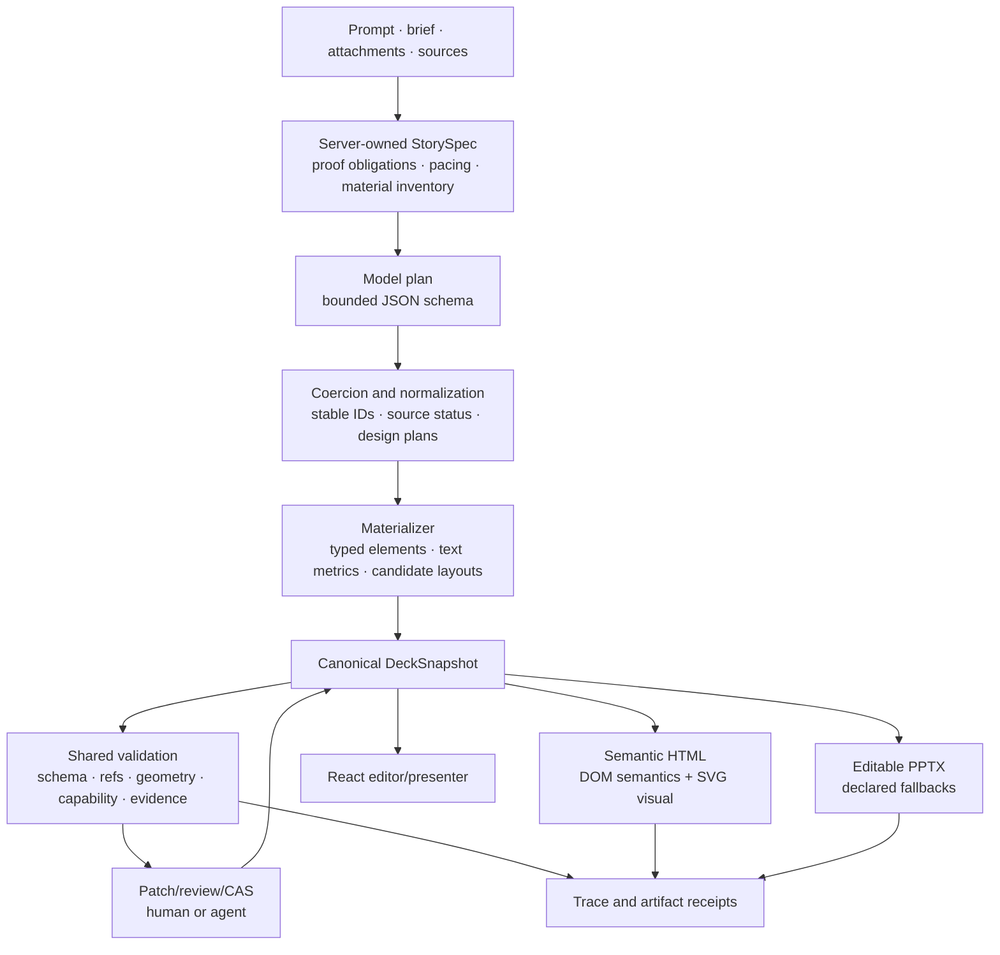

# From compact JSON to governed, semantic HTML

This document records how NodeSlide's authoring representation evolved from a
compact slide JSON file into the current governed pipeline:

```text
brief + evidence
→ model plan
→ normalized canonical DeckSnapshot
→ validation and bounded repair
→ browser editor / semantic HTML / editable PowerPoint
→ receipts and human review
```

It is deliberately a challenge-and-resolution history. A successful HTML file
was never the entire goal. The harder problem was preserving intent, evidence,
editability, accessibility, concurrency safety, and cross-format honesty while
people and multiple models continued changing the deck.

## History boundary

NodeSlide began inside `parity-studio` and was extracted into this standalone
repository on 2026-07-13. The predecessor history starts with
`61dac11` (`feat: launch NodeSlide private preview`) on 2026-07-10. The first
standalone source snapshot is `ac66f88`.

Therefore:

- hashes dated 2026-07-10 through the early 2026-07-13 work refer to the
  predecessor repository;
- hashes from `ac66f88` onward refer to this repository;
- the standalone extraction is not presented as the invention date for code
  that already existed in the predecessor.

## The original source shape

The first source project used compact `.sl.json` files. A slide declared a
fixed 1440 × 810 frame, then encoded boxes, text, and connectors as positional
arrays:

```json
{
  "v": "sl0",
  "fr": [1440, 810, 18],
  "meta": { "id": "slide_00", "title": "Living decks, built together" },
  "tx": [
    [
      "s00_title",
      88,
      185,
      760,
      170,
      "ttc",
      "Living decks,\nbuilt together",
      null,
      { "fs": 72, "ta": "l", "c": "#14213D", "ml": 2, "lh": 0.98 }
    ]
  ]
}
```

This was compact and deterministic, but it was not a good collaborative state
model:

- array position carried meaning;
- tokens such as `ttc`, `fs`, `ta`, and `ml` required compiler knowledge;
- geometry was bound to one pixel frame;
- relationships were string conventions rather than typed records;
- the format did not itself provide element clocks, scoped mutations, source
  lineage, accessibility contracts, or per-target capabilities.

The key decision was not to keep adding fields to this compact render format.
NodeSlide introduced a separate, explicit canonical document and treated HTML,
SVG, and PowerPoint as derived projections.

## The canonical shape that replaced it

The corresponding canonical element became self-describing and mutable by
stable identity:

```json
{
  "id": "element:headline",
  "slideId": "slide:overview",
  "name": "Headline",
  "kind": "text",
  "role": "title",
  "bbox": { "x": 0.06, "y": 0.07, "width": 0.62, "height": 0.14 },
  "rotation": 0,
  "content": "Editable native headline",
  "style": {
    "fontFamily": "Aptos Display",
    "fontSize": 40,
    "fontWeight": 700
  },
  "sourceIds": ["source:adoption"],
  "locked": false,
  "exportCapabilities": ["web_native", "pptx_editable"],
  "version": 1
}
```

The document is split into `deck`, `slides`, `elements`, and `sources`. Stable
IDs and normalized `0..1` geometry make an element addressable across browser
rendering, editing, revisions, evidence, HTML, and PowerPoint.

The HTML compiler then derives both a visual projection and a semantic
projection:

```html
<section data-slide-id="slide:overview" role="region">
  <div class="slide-semantics">
    <h2>Slide 1 of 1: Overview</h2>
    <h3 data-element-id="element:headline">Editable native headline</h3>
  </div>
  <svg data-slide-visual aria-hidden="true" viewBox="0 0 1440 810">
    <!-- visual shapes derived from the same element records -->
  </svg>
</section>
```

The semantic layer is not a second authored deck. It is generated from the
same snapshot and carries stable element/source IDs, meaningful headings,
lists, chart tables/summaries, media descriptions, math descriptions, and
source records.

## Evolution map

```mermaid
flowchart LR
  A["sl0 compact JSON<br/>positional arrays + pixels"]
  B["DeckSnapshot v1<br/>typed records + stable IDs"]
  C["Patch protocol<br/>scope + CAS + review"]
  D["Structured primitives<br/>chart · image · diagram · math · video"]
  E["Materializer<br/>brief/model plan → elements"]
  F["Shared validation<br/>text metrics + geometry + capabilities"]
  G["Semantic HTML<br/>accessible DOM + SVG visual"]
  H["Render-aware creation<br/>critique + candidate repair"]
  I["StorySpec/design plans<br/>materials + references + fan-out"]
  J["Artifact Atlas/Gym<br/>model and harness evidence"]
  K["Next: ArtifactSpec<br/>semantic invariants + deterministic compilers"]

  A --> B --> C --> D --> E --> F --> G --> H --> I --> J --> K
```



## Chronological ledger

| Stage | Challenge exposed | Resolution and invariant gained | Traceable history |
|---|---|---|---|
| 0. Compact source files | Positional JSON was concise but opaque, pixel-bound, and difficult to patch safely. | Keep the compact format as an input/compiler proof; introduce a self-describing canonical state instead of using render syntax as application state. | predecessor `61dac11` |
| 1. Canonical document and projections | Browser, HTML, and PPTX could drift if each became editable state. | `nodeslide.slidelang/v1` `DeckSnapshot` became the sole source; every target is derived. Stable IDs, normalized geometry, explicit style/data/source fields, and capability declarations entered the contract. | predecessor `61dac11`; standalone `ac66f88` |
| 2. Authoritative mutation | Direct JSON or DOM edits could bypass scope, overwrite concurrent work, or make agent changes invisible. | Human and agent changes compile to typed `PatchOperation[]`; server validation, scope checks, locked-element rules, base versions, per-record clocks, CAS/rebase, review, and immutable versions control mutation. | predecessor `7ef593d`; retained in `ac66f88` |
| 3. Structured primitives | Text boxes could describe a chart or process without creating an editable artifact. | Add typed chart/image records, then editable diagram nodes/connectors, math, video, grouping, and target-specific capability reports. A requested artifact must exist as the correct primitive. | predecessor `934f217`, `1d4e0b5`, `80787b6`; standalone `5b0faac`, `46eebaa` |
| 4. Inspectable JSON | A canonical JSON source was only useful to developers if users could not see it; arbitrary JSON writes were unsafe. | Add a JSON inspector and download; supported selection edits are parsed into governed patch operations and previewed. Full-snapshot arbitrary editing remains deliberately incomplete. | predecessor `676d82c`; standalone `4874005`, `8287128` |
| 5. Prompt/model plan to elements | Model prose was variable, could ignore slide counts, and could invent unsupported structures. Fixed-coordinate materialization made the same design repeatedly. | Bound the planning schema, sanitize/coerce fields, enforce requested 6–8 slide counts, materialize stable IDs deterministically, limit primary artifacts, and retain deterministic fallback. | predecessor `bb6d09e`, `934f217`, `74679d3`; standalone `8501f00`, `5339d59` |
| 6. Layout correctness | Fixed heights and simple stacking caused body/bullet collisions, text overflow, and opening-slide failures. Browser and server could disagree about whether a deck was clean. | Add text-height estimation, auto-nudge/reflow, shared geometry checks, and materialization-time failure. The same issue logic is used by server, browser, export, and tests. | `0aab113`, `a0d34f9`, `2e8ce2d` |
| 7. Layout monotony | A clean deck could still be the same editorial card repeated. Counting slides was not visual authorship. | Select archetypes from narrative/content shape; later require rhythm, distinct composition signatures, structured diagrams, and complete-deck review. | `9fc0d24`, `76a6623` |
| 8. HTML semantics and safety | A visual SVG alone is inaccessible; raw strings can create injection risk; media and citations can disappear from exports. | Generate parallel semantic DOM, escape all authored data, sanitize font families, embed source records safely, mark decoration, expose chart data as tables/summaries, and keep media/source fallbacks explicit. | predecessor `61dac11`; expanded in standalone `46eebaa`, `82fe487`, `bbf4aaf` |
| 9. Cross-format fidelity | Browser-native features do not automatically remain editable or truthful in PowerPoint. Remote images could be dropped and math could be mislabeled as editable text. | Maintain per-element capability reports; use native PowerPoint charts/shapes/connectors where possible; use declared static fallbacks for rendered math; embed approved images; record known fidelity differences. | predecessor `21f2b23`; standalone `5e4b1fb`, `9141672`, `9e81653`, `b8c9d30` |
| 10. Render-aware repair | Schema-valid JSON can still render badly. Initially, repair libraries existed without a live caller; later, creation could pass without exercising the revision branch. | Render and validate real candidates, retain attempt/digest receipts, derive typed repairs, preserve the base, and accept a revision only when its concrete issue report improves. Use synthetic faults only in explicitly dev-only acceptance. | predecessor `71d2e2f`; standalone `a99edcd`, `4bb122a` |
| 11. Story and visual materials | The model could claim screenshots/traces it did not have and choose artifacts without an explicit narrative job. | Build a server-owned `StorySpec`, proof obligations, pacing, and material inventory with `available`, `constructible`, `placeholder`, and `missing`; add per-slide design plans, bounded references, composition fan-out, and fail-closed candidate selection. | `76a6623` |
| 12. Evidence lineage | `sourceIds` alone did not prove that a visible claim matched a captured excerpt or region. | Preserve immutable source/snapshot context, bind claims to excerpts/regions, show citing elements, and keep missing capture states honest across browser and export. | `bbf4aaf`, `14dce0e`, `52e989f`, `955fbdb` |
| 13. Model/harness evaluation | One good deterministic deck or one model run could be mistaken for general capability. Overflow-clean output could still contain wrong equations, malformed diagrams, or stale evidence. | Add Artifact Atlas, paired Model Arena receipts, exact model attribution, costs, browser/PPTX pixels, and human-review gates. The V2 audit then correctly reopened semantic eligibility rather than treating file existence as visual approval. | `d53f1dc`, `7003dc1`; `docs/ARTIFACT_SEMANTICS_MODEL_GYM_GOAL.md` |

## Detailed challenges and resolutions

### 1. Render syntax was the wrong database

The compact `sl0` source was useful for authoring and compiler proof because it
was dense and deterministic. It was a poor authoritative collaboration model:
changing array position could change meaning, normalized resizing required
conversion, and an agent could not safely say “replace this headline if its
version is still 3.”

Resolution:

- separate `Deck`, `Slide`, `SlideElement`, and `SourceRecord` collections;
- give every record a stable public ID and version;
- use normalized geometry independent of the output frame;
- store type-specific data (`chart`, `math`, `image`, `video`) beside common
  identity, style, provenance, locking, and capability fields;
- derive render syntax from canonical state.

The invariant is: **no browser DOM, HTML file, SVG path, or PowerPoint object is
the editable source of truth.**

### 2. “Editable JSON” could not mean “replace the database blob”

Direct snapshot writes would have bypassed scope, comments, review, version
clocks, validation, and agent attribution. The JSON inspector therefore evolved
in two steps: first visible/copyable/downloadable canonical state, then bounded
editing of supported selected-element fields.

Resolution:

```text
JSON edit
→ parse and validate supported fields
→ compile PatchOperation[]
→ candidate preview
→ server scope/CAS/semantic validation
→ explicit acceptance
→ new canonical version
```

Arbitrary full-snapshot import/editing remains open because pretending it is
safe would violate the single mutation path.

### 3. A type name did not prove an artifact existed

Early decks could use prose or generic shapes where the narrative required a
chart or diagram. Later tests also revealed the inverse problem: captions and
receipts could claim an artifact that the rendered slide did not visibly show.

Resolution:

- typed primitive data and validators;
- renderer and PowerPoint adapters for the same primitive;
- artifact-presence gates against rendered output;
- native editability checks and explicit static/unsupported fallbacks;
- stable source bindings on the artifact itself.

This moved NodeSlide from “JSON describing a slide” to “JSON describing
inspectable presentation objects.”

### 4. Fixed geometry made valid JSON visually invalid

The original materializer chose fixed boxes for headline, body, bullets,
metrics, and charts. Longer copy or an opening visual could collide even when
every value passed the schema.

Resolution:

- estimate rendered text height from font, width, content, and line-height;
- compute body and bullet positions from measured budgets;
- validate geometry before persistence;
- auto-nudge or reflow bounded cases;
- share the same geometry implementation between server and client.

The failed assumption was that normalized coordinates alone created responsive
composition. They did not; content-aware measurement was required.

### 5. Geometry correctness did not create good visual storytelling

Twenty geometry-clean generations proved publishability, but not visual
richness. The same arrangement could be emitted under several archetype labels,
and a sequence of individually clean slides could still feel repetitive.

Resolution:

- choose layout archetypes from slide job and content shape;
- add semantic archetypes and dominant visual centers;
- require editable structured diagrams for relationship-heavy claims;
- detect repeated composition signatures and text-dominant runs;
- fan out materially different candidate geometries;
- review the complete thumbnail strip and exported PowerPoint.

The newer Atlas audit added a further correction: even attractive variety does
not prove diagram semantics, arithmetic, or evidence truth.

### 6. Browser HTML needed two simultaneous representations

A slide is spatial, but a screen reader and search/indexing system need a
meaningful document order. Making the SVG accessible directly would have
produced a noisy collection of decorative paths and disconnected text.

Resolution:

- render the visible slide as SVG/HTML media from normalized geometry;
- render a parallel visually hidden semantic tree from the same ordered
  elements;
- represent headings, paragraphs, lists, figures, tables, math, media, and
  sources using appropriate HTML structures;
- keep the visual SVG `aria-hidden` and decoration excluded;
- retain `data-slide-id`, `data-element-id`, `data-element-kind`, and
  `data-source-ids` in both debugging and evidence surfaces;
- escape authored content and serialize embedded source JSON so `</script>` and
  related characters cannot break the document.

This is why NodeSlide calls the export semantic HTML rather than an SVG dump.

### 7. One canonical state did not guarantee cross-format parity

HTML can play video and typeset KaTeX; PowerPoint has different native
capabilities. A renderer that silently rasterized or dropped content would make
the canonical JSON misleading.

Resolution:

- compute declared and effective capability reports per element;
- export text, shapes, connectors, and supported charts as native PowerPoint
  objects;
- render valid math to a declared static fallback;
- embed approved images instead of depending on remote availability;
- label video and unsupported paths explicitly;
- record the browser-versus-PowerPoint difference in receipts.

The invariant is semantic honesty, not impossible pixel identity.

### 8. Validation needed to consume rendered facts

Schema validators can prove types, references, and ranges. They cannot prove
that text fits in the chosen font, a chart is visible, or a model-generated
repair improved the pixels.

Resolution:

- use deterministic structural validation before render;
- render the real canonical candidate;
- observe geometry/artifact presence and generate concrete issue codes;
- apply only bounded typed repair proposals;
- retain attempt and digest lineage;
- require strict improvement before adopting a model revision;
- keep unrepaired candidates and red receipts instead of rewriting history.

The next semantic validators extend this principle to arithmetic, graph
direction, Sankey conservation, evidence MIME/version binding, and comparison
cohort compatibility.

### 9. Model output needed server-owned context and normalization

Prompt-only generation invited several failure classes: ignored slide counts,
invented evidence, unsupported artifact requests, provider-specific JSON quirks,
and long-tail timeouts.

Resolution:

- bounded response schemas and field coercion;
- explicit slide-count requirements and server verification;
- route-specific reasoning and time budgets;
- deterministic fallback that is labeled as such;
- server-owned StorySpec and material status that model output cannot promote;
- design plans and reference IDs chosen by the server;
- creation critique and one bounded improving revision.

This is the bridge from an unconstrained language-model response to dependable
canonical JSON.

### 10. Receipts themselves became part of the correctness problem

Artifact Atlas V2 proved that a receipt can be structurally complete and still
be epistemically wrong. Its finalizer treated the existence of rendered files
as a visual pass, so wrong arithmetic and misleading diagrams appeared green.

Resolution in progress:

- separate syntactic render, geometry, semantic validity, evidence validity,
  accessibility, cross-format fidelity, and human preference;
- bind each stage to input/output digests and issue codes;
- never let a later stage overwrite an earlier failure;
- introduce typed `ArtifactSpec` families and deterministic semantic compilers;
- compare model/harness pairs only on matched tasks, evidence, budgets, and
  repeated runs.

The implementation plan is
[`ARTIFACT_SEMANTICS_MODEL_GYM_GOAL.md`](./ARTIFACT_SEMANTICS_MODEL_GYM_GOAL.md).

## Current pipeline and ownership



| Responsibility | Current owner |
|---|---|
| Canonical deck/slide/element/source and patch contracts | [`shared/nodeslide.ts`](../shared/nodeslide.ts), [`shared/nodeslidePatch.ts`](../shared/nodeslidePatch.ts) |
| Model-plan normalization and materialization | [`convex/lib/nodeslideSeed.ts`](../convex/lib/nodeslideSeed.ts) |
| Story/material context | [`convex/lib/nodeslideStoryContext.ts`](../convex/lib/nodeslideStoryContext.ts) |
| Design plans and composition candidates | [`convex/lib/nodeslideDesignPlan.ts`](../convex/lib/nodeslideDesignPlan.ts), [`convex/lib/nodeslideCompositionFanout.ts`](../convex/lib/nodeslideCompositionFanout.ts) |
| Shared geometry policy | [`shared/nodeslideLayoutMetrics.ts`](../shared/nodeslideLayoutMetrics.ts), [`shared/nodeslideGeometryChecks.ts`](../shared/nodeslideGeometryChecks.ts) |
| Browser editor rendering | [`src/domains/nodeslide/components/SlideRenderer.tsx`](../src/domains/nodeslide/components/SlideRenderer.tsx) |
| Standalone semantic HTML | [`src/domains/nodeslide/slidelang/html.ts`](../src/domains/nodeslide/slidelang/html.ts) |
| PowerPoint projection | [`src/domains/nodeslide/slidelang/pptx.ts`](../src/domains/nodeslide/slidelang/pptx.ts) |
| Validation/capabilities/repair | [`src/domains/nodeslide/slidelang/validation.ts`](../src/domains/nodeslide/slidelang/validation.ts), [`src/domains/nodeslide/slidelang/capabilities.ts`](../src/domains/nodeslide/slidelang/capabilities.ts), [`convex/lib/nodeslideValidation.ts`](../convex/lib/nodeslideValidation.ts) |
| Artifact/model/harness evaluation | [`scripts/lib/artifact-atlas-core.mjs`](../scripts/lib/artifact-atlas-core.mjs), [`scripts/lib/deck-gym-core.mjs`](../scripts/lib/deck-gym-core.mjs) |

## Lessons retained as engineering rules

1. A render format is not automatically a safe application state model.
2. Stable identity and version clocks matter before sophisticated generation.
3. Normalized coordinates do not replace text measurement or composition logic.
4. A schema-valid deck can be visually invalid; a visually clean deck can be
   semantically invalid.
5. Artifact type, rendered presence, evidence lineage, and editability are
   separate claims and need separate gates.
6. HTML accessibility needs a semantic reading tree, not only accessible SVG
   labels.
7. Cross-format truth is more important than pretending every target is native.
8. Models should choose intent and fill typed specifications; deterministic code
   should own arithmetic, geometry, clipping, routing, and export construction.
9. Receipts require validation too. File existence is evidence of a file, not
   evidence of correctness.
10. Model improvement must be measured on matched tasks with exact route,
    context, tools, budget, repairs, and repeated trials.
